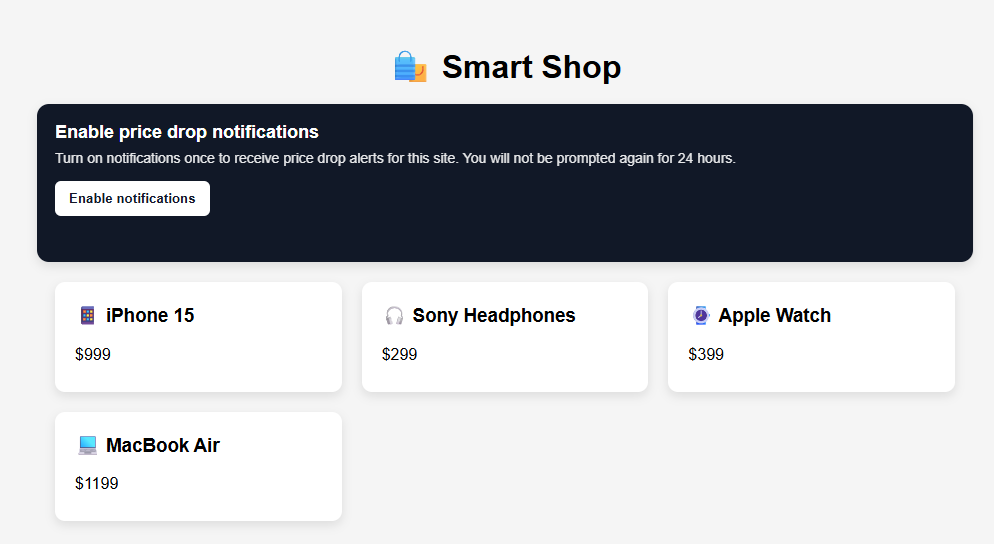

# ユーザー権限の取得

このweb ページは、プッシュ通知の受信に対するユーザーの同意を取得します。 ブラウザーのNotifications APIを使用して通知を有効にするよう求め、同意すると、Web SDKを使用してAdobe Experience Platformにプッシュサブスクリプションを登録します。 これにより、オプトインしたユーザーのみが、Adobe Journey Optimizerのキャンペーンとジャーニーを通じてプッシュ通知を受け取ることができます。

Web プッシュ通知を有効にするには、まずページは初期化関数内でfetch （&quot;/config&quot;）を呼び出して設定ファイルを読み込みます。 この設定はNode.js アプリケーションによって提供され、データストリーム ID、組織ID、VAPID公開鍵、アプリ ID、トラッキングデータセット IDなどのキー値が含まれます。 設定が読み込まれると、Adobe Web SDKが初期化され、プッシュメッセージをサポートするためにService Workerが登録されます。 ユーザーが「通知を有効にする」をクリックすると、ブラウザーはWeb通知APIを使用して権限を求めるメッセージを表示します。 権限が付与された場合、Web SDKはプッシュ通知をAdobe Experience Platformに送信し、ユーザーは24時間オプトインとしてマークされ、プロンプトの繰り返しを防ぐことができます。 このフローは、サーバーの起動後、[ サンプルアプリケーション ](http://localhost:3000/)に含まれるローカル web ページ shop-smart.htmlで試すことができます。

