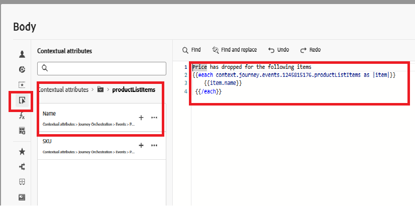

# ジャーニーを作成

この手順では、カスタム price.drop イベントによってトリガーされるジャーニーをAdobe Journey Optimizerで作成します。 このイベントを受信すると、ジャーニーはリアルタイムで開始され、オプトインしたユーザーにプッシュ通知を送信し、イベント主導のエンゲージメントを可能にします。

price.drop イベントでトリガーされるジャーニーを作成するには、次の手順に従います

* Journey Optimizerにログインします
* ジャーニー管理に移動| ジャーニー | ジャーニーの作成

## PriceDropEventを追加

`PriceDropEvent`をイベントセクションからキャンバスにドラッグします

## プッシュアクションを追加

Expand the Actions section. Drag and drop the `Action` activity on to the canvas and select Push as the action type

## Configure the Push Action

プッシュ通知アクティビティを選択し、「設定」アクションをクリックします

## プッシュ通知チャネルの設定

チュートリアルの前に作成した`MyFirstWebPushChannel`設定をこのプッシュ通知に関連付けます

## プッシュ通知メッセージの作成

パーソナライゼーションエディターを使用して、プッシュ通知に静的コンテンツと動的コンテンツの組み合わせを追加し、メッセージをより魅力的で関連性の高いものにします。

To begin composing the message, click on `Content` to open the content tab, where you can define both the fixed text and the dynamic fields derived from the event data.

Specify the title of the push message, then open the personalization editor to compose the message body. The content will dynamically include the names of the product(s) whose prices have dropped. To achieve this, use the each [helper function](https://experienceleague.adobe.com/ja/docs/journey-optimizer/using/content-management/personalization/functions/helpers#each)
to iterate over the list of products and render their names within the message.

## メッセージ本文の作成

ヘルパー関数メニューから`Each`関数を選択して挿入します。

コンテキスト属性を選択| Journey Orchestration | イベント | PriceDropEvent | productListItems |名前

「+」アイコンをクリックして、パーソナライゼーションエディター内の各ループに配列を挿入します。 次に、参照スクリーンショットに表示されている形式に合わせてメッセージコンテンツを更新します。 環境に表示されるイベント IDは、表示されているものと異なる場合があります。

最後に、変更内容をすべて保存し、ジャーニーを公開します。 公開されると、ジャーニーはアクティブになり、price.drop イベントが受信されるのをリッスンします。 Whenever such an event is received, the journey is triggered in real time, and a push notification is sent to users who have opted in to receive notifications, ensuring timely and relevant engagement.

## Test the solution

To trigger the price.drop event, open the [price drop trigger page,](http://localhost:3000/price-drop-trigger.html) select one or more products, and click Trigger Price Drop. This sends the event through the Adobe Data Layer using AEP Tags, which then initiates the journey and delivers the push notification in real time.

