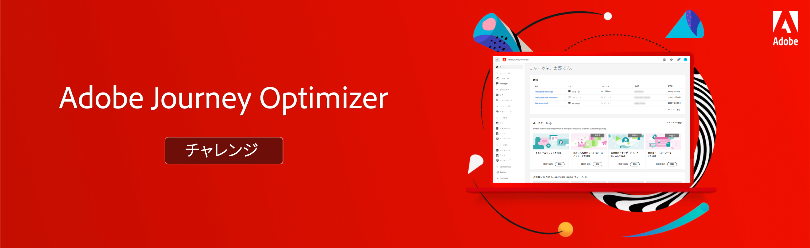

# Journey Optimizerの課題 — 概要と前提条件

課題は、学習した内容を実行するために必要なシナリオと要件を提供します。 課題は、スキルレベルを評価し、知識のギャップを特定するのに役立ちます。

この節の各課題では、実装する固有の使用例について説明します。 各チャレンジの最初に、ターゲットオーディエンス（ペルソナ）と必要なスキルを記載します。

## 前提条件

### 必要システム構成

* Journey Optimizerサンドボックスへのアクセス — 専用のトレーニングサンドボックスでチャレンジを完了することをお勧めします。
* AEM Assets Essentials をインスタンス用にプロビジョニングする必要があります
* E メールチャネルは、トランザクションメッセージとマーケティングメッセージに対して設定する必要があります

### アクセス権

次のアクセス権が必要です。
* *ジャーニー管理* または *ジャーニー管理者*
* テストプロファイルとその属性の表示

>[!NOTE]
> 演習は Luma サンプルデータに基づいて開発されました。 サンプルデータを使用して設定されたトレーニングサンドボックスを設定することをお勧めします。 チュートリアルを参照してください [トレーニングサンドボックスの設定](/help/tutorial-configure-a-training-sandbox/introduction-and-prerequisites.md) 」を参照してください。

### 必要なアクション

* Adobe Journey Optimizerを初めて使用する場合は、コースを修了してください [Journey Optimizerを使い始める (ジャーニーマネージャーと管理者向け )](https://experienceleague.adobe.com/?recommended=JourneyOptimizer-U-1-2021.1&amp;lang=ja).

## ザストーリー

Luma は架空のスポーツアパレル会社で、複数の国に店舗があり、Web サイトでのオンラインプレゼンス、モバイルアプリがあります。 Luma はAdobe Journey Optimizerを使用して、接続された、コンテキストに沿った、パーソナライズされたエクスペリエンスを顧客に提供します。

Luma は、最新のアパレルとギアコレクションを宣伝し、既存のお客様への販売促進を目指しています。 Journey Optimizerで Luma のマーケティングキャンペーンとリテンションキャンペーンを実装するために雇われています。

## 課題

<table>
<tr>
<td>
 

      
      

  </td>
  <td>
   <strong><a href="summer-collection-announcement-challenge.md">夏物コレクションのお知らせの作成 </strong>
    </a>
      

      <em>既存の顧客のセグメントに夏物コレクションのお知らせメールを送信するジャーニーを作成します。 </em>
      

      <b>必要なスキル：</b>
      <li><a href="https://experienceleague.adobe.com/docs/journey-optimizer-learn/tutorials/profiles-segments-subscriptions/create-segments.html"> セグメントの作成</li>
      <li><a href="https://experienceleague.adobe.com/docs/journey-optimizer-learn/tutorials/create-journeys/use-case-read-segment.html">セグメントの読み取り</li>
       <li><a href="https://experienceleague.adobe.com/docs/journey-optimizer-learn/tutorials/create-messages/create-emails/import-and-author-html-email-content.html">HTMLE メールコンテンツを読み込む</li>
  </td>
  </tr>
   <tr>
    <td>
    

    
    

    <td>
    

      <a>
    <strong><a href="loyalty-status-welcome-email-challenge.md">ロイヤルティステータスのお知らせメールの作成 </strong>
    </a>
    

    

    <em>ロイヤルティ顧客が新しい層に移り、新しいメリットを祝福し、通知したら、E メールを送信します。</em>
    

    <b>必要なスキル：</b>
      <li><a href="https://experienceleague.adobe.com/docs/journey-optimizer-learn/tutorials/profiles-segments-subscriptions/create-segments.html"> セグメントの作成</li>
      <li><a [href="https://experienceleague.adobe.com/docs/journey-optimizer-learn/tutorials/create-journeys/use-case-read-segment-qualification.html">セグメントの選定</li>
      <li><a href="https://experienceleague.adobe.com/docs/journey-optimizer-learn/tutorials/create-messages/create-emails/import-and-author-html-email-content.html">HTML 電子メールコンテンツの読み込みと作成</li>
  </td>
  </tr>
  <tr>
  <td>
  

    
  </td>
  <td>
      <a href="order-confirmation-challenge.md">
    <strong><a href="order-confirmation-challenge.md">注文の確認を作成</strong>
    </a>
    

    

    <em>トランザクションメッセージの作成方法とパーソナライズ方法に関する知識をテストします
    </em>
    

    <b>必要なスキル：</b>
      <li><a href="https://experienceleague.adobe.com/docs/journey-optimizer-learn/tutorials/create-messages/create-content-with-the-email-designer.html"> メッセージエディターでの電子メールコンテンツの作成</li>
      <li><a href="https://experienceleague.adobe.com/docs/journey-optimizer-learn/tutorials/personalize-content/use-contextual-event-information-for-personalization.html">パーソナライゼーションに関するコンテキストイベント情報の使用</li>
      <li><a href="https://experienceleague.adobe.com/docs/journey-optimizer-learn/tutorials/personalize-content/use-helper-functions-for-personalization.html?lang=en">パーソナライゼーションへのヘルパー関数の使用</li>
  </td>
</table>
