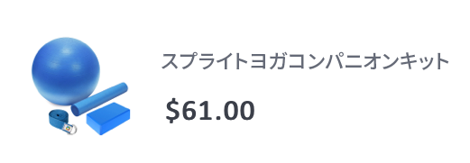
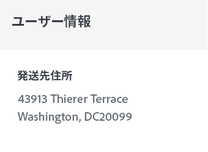

# 注文確認 E メールの作成


| 課題 | 注文確認トランザクション E メールの作成 |
|---|---|
| ペルソナ | ジャーニーマネージャー |
| 必要なスキル | <ul><li>[メッセージエディターでの電子メールコンテンツの作成](https://experienceleague.adobe.com/docs/journey-optimizer-learn/tutorials/create-messages/create-email-content-with-the-message-editor.html?lang=en)</li> <li>[パーソナライゼーションに関するコンテキストイベント情報の使用](https://experienceleague.adobe.com/docs/journey-optimizer-learn/tutorials/personalize-content/use-contextual-event-information-for-personalization.html?lang=en)</li><li>[パーソナライゼーションへのヘルパー関数の使用](https://experienceleague.adobe.com/docs/journey-optimizer-learn/tutorials/personalize-content/use-helper-functions-for-personalization.html?lang=en)</li></ul> |
| ダウンロードするアセット | [注文確認アセット](/help/challenges/assets/email-assets/order-confirmation-assets.zip) |

## ザストーリー

Luma は、オンラインストアを立ち上げており、顧客が注文した後に注文確認 E メールを送信して、優れた顧客体験を実現したいと考えています。


## 課題

Luma の顧客がオンラインでの注文を完了した際に注文確認 E メールを送信するジャーニーを作成します。 ルマ

>[!BEGINTABS]

>[!TAB タスク]

1. という名前のジャーニーを作成します。 `Luma - Order Confirmation`
2. イベントの使用： `LumaOnlinePurchase` トリガー
3. 次の名前の注文確認 E メールを作成 `Luma - Order Confirmation`:

* カテゴリトランザクション — 必ずトランザクション E メールの表面を選択してください。
* 件名は、受信者の名でパーソナライズする必要があります。また、「ご購入ありがとうございました」というフレーズを含める必要があります。
* 以下を使用： `Luma - Order summary` テンプレートを作成し、変更します。

E メールは、次のような構造にする必要があります。
<table>
<tr>
<td>
  <div>
     <strong> ヘッダーセクション</strong>
      </div>
  </td>
  <td>
    <strong>Luma ロゴ</strong>
      <p>
     <li>luma_logo.png</li>
    <li>Luma Web サイトへのリンクが必要です。https://publish1034.adobedemo.com/content/luma/us/en.html</li>
    <p>
    </td>
  </tr>
  <tr>
  <td>
  <div>
    <strong>注文確認セクション
    </strong>
  </td>
  <td>
    <p>
    <strong>テキスト</strong><p>
    <em>おい {first name}</em><p>
    <li>整列：left  </li>
   <li>テキストカラー：rgb(69, 97, 162) #4461a2; 
   <li>font-size:20px</li>
   <div>
    <p>
     <em>注文が完了しました。
    <p>お客様のパッケージが出荷されたら、追跡番号が記載されたメールをお送りします。お客様のご注文を追跡できます。</p></em>
    </strong>
    </tr>
  </td>
 <td>
  <div>
     <strong> 出荷先セクション</strong>
      </div>
      <p><li>テンプレートのハードコードされた住所を配送先住所に置き換えます 
      <li>詳細は、イベント（番地、市区町村、郵便番号、都道府県）のコンテキスト属性です
      <li>姓と名はプロファイルから取得されます
      <li> 割引、合計、到着済みを削除</p>
  </td>
  <td>
  <p> 送付先：</p>
      <em>姓<br>
      住所<br></em></p>
  </td>
 <tr>
<td>
  <div>
     <strong>注文の詳細セクション</strong>
      </div>
       <p><li>このセクションを <b>送付先</b> セクションおよび <b>注文を表示</b> ボタン
      </p><br>
      <p><b>ヒント:</b>
      <li>これはコンテキストイベント情報です。
      <li>[!UICONTROL ヘルパー関数 ] を使用します。[!UICONTROL Each]
      <li>コードエディターの形式に切り替えて、コンテキストデータを追加します。
      <li>DIV タグを使用して、コンテナに情報を配置します。
  </td>
  <td>
    <strong>ヘッダー</strong>
    <p>
    <em>注文：'purchaseOrderNumber'</em>
    </p>
    <strong>注文された製品のリスト：
  </strong>
  <p>各項目は、次のような形式にする必要があります。
    
</p>
<strong>製品画像：</strong>
<li>クラス：買い物かごの椅子
<li>スタイル：border-box:min-height:40px</li>
<li>padding top and bottom:20px</li>
<li>padding-left:80px</li>
<li>border-radius:0px</li>
<li>コンテナの背景画像として使用</li>
<li>background-position:0% 50%</li>
<li>background-size:60px</li>
<li>background-repeat:no-repeat</li>
<p>
<strong>価格:</strong>
<li>形式= H5</li>
<li>style = box-sizing:border-box</li>
<li>margin-bottom:5px</li>
<li>margin-top:0px;</li>
<p>
<strong>名前と数量：</strong>
<li>class=text-small</li>
<li>style=box-sizing:border-box</li>
<li>padding-top:5px</li>
<li>色：rgb(101, 106, 119)</li>
<li>font-size:14px</li>
<p>
</td>
  </tr>
</table>


>[!TIP]
>
>ジャーニーのトラブルシューティングを可能にするベストプラクティスは、タイムアウトまたはエラーの場合に、すべてのメッセージアクションに代替パスを追加することです。

>[!TAB 達成基準]

テストモードで作成したジャーニーをトリガーし、自身に E メールを送信します。

1. 目の記号をクリックして、非表示の値を表示します。
   1. E メールパラメータで、T 記号をクリックします（パラメータの上書きを有効にします）。
      
   2. 「アドレス」フィールドをクリックします。
   3. 次の画面で、括弧内にメールアドレスを追加します。 *yourname@yourdomain* 式エディターで、「 ok 」をクリックします。
2. ジャーニーをテストモードにする
3. 次のパラメーターを使用してイベントにトリガーを設定します。
   * プロファイル識別子の設定：ID 値：`a8f14eab3b483c2b96171b575ecd90b1`
   * イベントタイプ：commerce.purchases
   * 名前：Sprite Yoga Companion Kit
   * 数量：1
   * 価格合計：61
   * 注文番号：6253728
   * SKU:24-WG080
   * productImageURL: <https://publish1034.adobedemo.com/content/dam/luma/en/products/gear/fitness-equipment/luma-yoga-kit-2.jpg>
   * 

指定した製品と共に、パーソナライズされた購入確認 E メールが届きます。

* 件名行には、テストプロファイルの名が含まれている必要があります。レオラ
* 注文の詳細セクションには、テスト中に入力した注文の詳細を入力する必要があります
* この *送付先* セクションには、テストプロファイルの市区町村と郵便番号を入力する必要があります。

   43913 Thierer Terrace, Washington DC 20099


>[!TAB 作業内容を確認する]

**ジャーニー**


**メール**

**件名:**

{{ profile.person.name.firstName }}、ご購入ありがとうございました。

**出荷先セクション：**

コードは次のようになります。

```javascript
{{ profile.person.name.firstName }} {{ profile.person.name.lastName }}
{{context.journey.events.454181416.commerce.shipping.address.street1}}
{{context.journey.events.454181416.commerce.shipping.address.city}}, {{context.journey.events.454181416.commerce.shipping.address.state}} {{context.journey.events.454181416.commerce.shipping.address.postalCode}}
```

*event.45481416* は別の数になります。

ヒント：各行を個別にパーソナライズ

**注文の詳細セクション：**


コードは次のようになります。

ヘッダー:

```javascript
Order: {{context.journey.events.1627840522.commerce.order.purchaseOrderNumber}}
```

製品のリスト：

ヘルパー関数「each」を使用して、製品のリストを作成します。 コードは次のようになります。

```javascript
{{#each context.journey.events.1911672547.productListItems as|product|}}
<div class="cart-item-chair" style="box-sizing:border-box;min-height:40px;padding-top:20px;padding-bottom:20px;padding-left:80px;border-radius:0px;background-image:url({{product._wwfovlab065.productImageURL}});background-position:0% 50%;background-size:60px;background-repeat:no-repeat;">
<h5 style="box-sizing:border-box;margin-bottom:5px;font-size:16px;line-height:20px;margin-top:0px;">${{product.priceTotal}}.00</h5>
<div class="text-small" style="box-sizing:border-box;padding-top:5px;color:rgb(101, 106, 119);font-size:14px;">{{product.name}}</div><div class="text-small" style="box-sizing:border-box;padding-top:5px;color:rgb(101, 106, 119);font-size:14px;">Quantity: {{product.quantity}}</div></div><div class="divider-small" style="box-sizing:border-box;height:1px;margin-top:10px;margin-bottom:10px;background-color:rgb(209, 213, 223);"> </div>
{{/each}}

Total: ${{context.journey.events.1627840522.commerce.order.priceTotal}} 
```

**顧客情報セクション**



パーソナライゼーションは次のようになります。

```javascript
{{profile.homeAddress.street1}}
{{profile.homeAddress.city}},{{profile.homeAddress.state}} {{profile.homeAddress.postalCode}}
```

>[!ENDTABS]