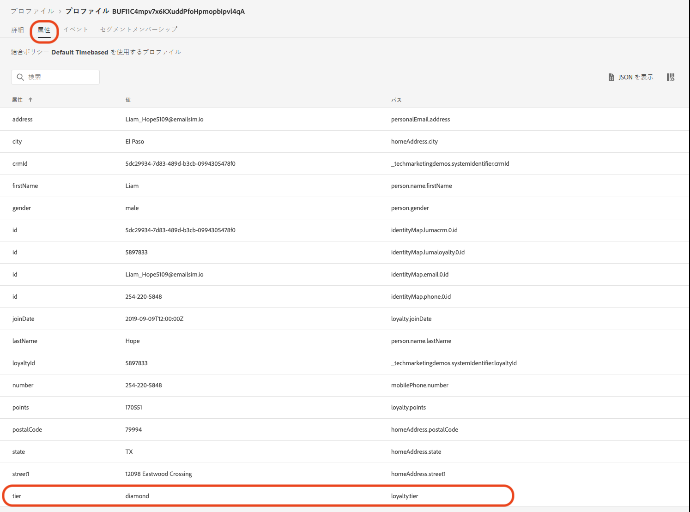
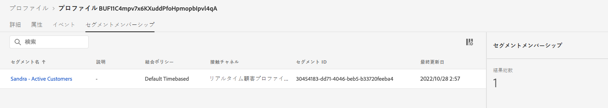

# 夏物コレクションのお知らせの作成 - 課題


| 課題 | 夏物コレクションのお知らせの作成 |
|---|---|
| ペルソナ | ジャーニーマネージャー |
| 必要なスキル | <ul><li>[セグメントの作成](https://experienceleague.adobe.com/docs/journey-optimizer-learn/tutorials/profiles-segments-subscriptions/create-segments.html?lang=ja)</li><li> [HTML メールコンテンツの読み込みと作成](https://experienceleague.adobe.com/docs/journey-optimizer-learn/tutorials/create-messages/create-emails/import-and-author-html-email-content.html?lang=ja)</li><li>[ユースケース - セグメントの読み取り](https://experienceleague.adobe.com/docs/journey-optimizer-learn/tutorials/create-journeys/use-case-read-segment.html?lang=ja)</li> |
| ダウンロードするアセット | [季節ごとのコレクションのメールファイル](/help/challenges/assets/email-assets/emails-seasonal-collection-announcement.zip) |

{style="table-layout:auto"}

## ストーリー

架空のアスレチックアパレル会社である Luma は、最新のアパレルとギアコレクションを宣伝し、既存顧客の売り上げを伸ばしています。Luma は、新しい夏物コレクションを発表しており、様々な顧客セグメントを具体的にターゲットにしたいと考えています。

## 課題

Luma マーケティングチームから、Journey Optimizer で夏物コレクションのマーケティングキャンペーンを実装するよう依頼されています。課題は、次のとおりです。

* プロモーションを受け取る選定プロファイルを定義するセグメントを作成します。
* ジャーニーを構築します。

### 手順 1：セグメントの定義 - アクティブな顧客

>[!BEGINTABS]

>[!TAB タスク]

#### [!DNL Journey Optimizer] でのセグメントの作成

* *アクティブな顧客*&#x200B;という [!DNL Journey Optimizer] のセグメントを作成します。
* セグメントには、アクティブな Luma の顧客のみを含める必要があります。
* アクティブな顧客は、Luma のロイヤルティプログラム（ブロンズ、シルバー、ゴールドまたはプラチナ）の層を持つ顧客として定義されます。


>[!TAB 成功基準]

セグメントビルダーで、選定済みプロファイルの推定数を確認できます。トレーニングサンドボックスデータを使用する場合、1.29 K 中 753 個の選定済みプロファイルがあります。

>[!NOTE]
>既存のプロファイルをバックフィルする必要があるので、既存のプロファイルに対してセグメントメンバーシップが表示されるまでに最大 24 時間かかる場合があります。

**選定中のプロファイルがセグメントに追加されました。**

セグメントの詳細ビューにリストされているプロファイルのいずれかに移動して、セグメントに追加されたプロファイルが選定されていることを確認できます。

プロファイルページで、「[!UICONTROL 属性]」タブを確認して、選定されていることを確認します。層は、シルバー、ゴールド、プラチナまたはダイヤモンドである必要があります。



「[!UICONTROL セグメントメンバーシップ]」タブを確認することもできます。セグメントがリストされています。



>[!TAB 作業内容の確認]

セグメントフィールド：**[!UICONTROL 属性]**／**[!UICONTROL XDM 個人プロファイル]**／**[!UICONTROL ロイヤルティ]**／**[!UICONTROL 層]**

セグメントは、次のようになります。


コードは、次のようになります。

```javascript
stringCompare("equals", loyalty.tier, ["diamond", "gold", "platinum", "silver"], false)
```

>[!ENDTABS]


### 手順 2：ジャーニーの作成 - 夏物コレクションのお知らせ

>[!BEGINTABS]

>[!TAB タスク]

#### 夏物コレクションのお知らせの送信

代理店から、メールのデザインを含む 4 つの HTML ファイルが提供されました。

* `SeasonalCollectionEmail.html`
* Luma メンズコレクションのメール
* Luma レディースコレクションのメール
* Luma - 20％オフコレクションのメール

1. [季節ごとのコレクションのメールファイルをダウンロードします](/help/challenges/assets/email-assets/emails-seasonal-collection-announcement.zip)。

1. 次のガイドラインに基づいて、*Luma - 夏物コレクションのお知らせ*&#x200B;というジャーニーを作成します。

   1. *Luma - 夏物コレクションのお知らせ*&#x200B;メールを&#x200B;*アクティブな顧客*&#x200B;セグメントに送信し、オーディエンスの 10％をコントロール母集団として保持します。
      * メッセージタイトル *Luma - 夏物コレクションのお知らせ*
      * 件名&#x200B;*（受信者の名）様、新しい Luma 夏物コレクションが登場します。*
      * メール本文には、提供された HTML ファイル `SeasonalCollectionEmail.html` を使用します。
   1. 2 日待ってから、よりターゲットを絞った内容を含むフォローアップメールメッセージを送信します。
      * 男性の顧客には、**Luma メンズコレクション**&#x200B;メールが届きます。
         * メッセージタイトル：*Luma メンズコレクション*
         * 件名：*（受信者の名）様、メンズの新しいアスレチックギアを探索してください。*
         * メール本文：メール本文の `MensCollectionEmail.html`。
      * 女性の顧客には、**Luma レディースコレクション**&#x200B;メールが届きます。
         * メッセージタイトル：*Luma レディースコレクション*
         * 件名：*（受信者の名）様、Luma のレディースコレクションを探索してください。*
         * メール本文： `WomensCollectionEmail.html`
      * その他の顧客には、**Luma - 20％オフコレクション**&#x200B;メールが届きます。
      * メッセージタイトル：*Luma - 20％オフコレクション*
      * 件名：*（受信者の名）様、20％オフのセールをお楽しみください。*
      * メール本文：`20OOffCollectionEmail.html`
   1. 上記のターゲットメールを送信した後、メールが開封されるまで 2 日間待ちます
   1. ターゲットメールが 2 日以内に開かれない場合は、最後のリターゲティング試行として **Luma - 20％オフコレクションのメール**&#x200B;を送信します


>[!TAB 成功基準]

#### メールのプレビュー

**メールメッセージ #1 - Luma - 夏物コレクションのお知らせ**

メールのプレビュー：

1. テストプロファイルの追加：Louise Petti：
   * ID 名前空間：*Luma CRM ID*
   * ID 値：*d1f132f9f9502bba047a6ec86c4b61f9*

結果：

* 件名は、次のようになります。Louise 様、新しい Luma コレクションが登場します。

**メールメッセージ #2 - Luma メンズコレクション**

自分への配達確認の送信：

1. テストプロファイルの追加：Stanleigh Stooke
   * ID 名前空間：*Luma CRM ID*
   * ID 値：`4f34057d9d9e792c28ba18ecae378e98`
2. テストプロファイルの選択：Stanleigh Stooke。
3. 自分に配達確認を送信します。

結果：\
メールが届きます。件名は、次のようになります。*Stanleigh 様、メンズの新しいアスレチックギアを探索してください。* とメール本文は、プレビューで確認した内容と一致している必要があります。

>[!NOTE]
>配達確認を受け取るまでに数分かかる場合があります。

**メールメッセージ #3 - Luma レディースコレクション**

テストプロファイル *Louise Petti* を含むメールをプレビューします。

* 件名は、次のようになります。*Louise 様、Luma のレディースコレクションを探索*

**メールメッセージ #4 - Luma 20％オフコレクション**

テストプロファイル *Louise Petti* を含むメールをプレビューします。

* 件名は、次のようになります。*Louise 様、20％オフのセールをお楽しみください*

#### ジャーニーのテスト

>[!IMPORTANT]
>
>ジャーニーをテストモードに設定する前に、次の手順を実行します。
>
>1. [!UICONTROL セグメントを読み取りアクティビティ]の名前空間が **Luma CRM id(lumaCrmId)** に設定されていることを確認します。
>1. メールごとに、メールのデフォルトのメールパラメーターを上書きして、メールアドレスに送信されるようにします。
>    * 目の記号をクリックして、非表示の値を表示します。
>    * メールパラメーターで、T 記号をクリックします（パラメーターの上書きを有効にします）。
>
>      
> 
>    * 「[!UICONTROL 住所]」フィールドをクリックします
>    * 次の画面で、括弧内にメールアドレスを追加します。式エディターで `"yourname@yourdomain"` を入力し、「OK」をクリックします。
>

ジャーニーをテストし、自分のアカウントにメールを送信します。

1. ジャーニーをテストモードにします。
1. **[!UICONTROL 一度に 1 つのプロファイル]**&#x200B;を選択します。
1. 待機時間：タイマーを 120 秒に設定します（フィールドに入力します）。
1. プロファイルエントリのトリガー
1. 次の *Luma CRM Id* をプロファイル識別子として使用して、各ブランチをテストできます。
   * 女性：Leora Dietsche、ID 値：`a8f14eab3b483c2b96171b575ecd90b1`
   * 男性：Stanleigh Stooke、ID 値：`4f34057d9d9e792c28ba18ecae378e98`
   * 性別が指定されていません：Louise Petti、ID 値：`d1f132f9f9502bba047a6ec86c4b61f9`

1. プロファイルエントリをトリガーすると、最初のメールが届きます。ヘッダーは、選択したプロファイルに応じてパーソナライズする必要があります。
1. ジャーニーは、それぞれの分岐に進み、関連するメールが届きます（例：*ジェナ*&#x200B;を選択した場合は、*Luma レディースコレクション*&#x200B;のメールが届きます）。
1. 2 通目のメールを開くと、ジャーニーは終了します。
1. 手順 4 ～ 7 を繰り返すことができます。3 つのプロファイルで、分岐が正しく動作しているかどうかを確認してください。
1. タイムアウトをテストするには、待機時間を 30 秒に設定し、再度エントリをトリガーします。
1. 受信したメールを開かないでください（メールをプレビューしないでください（！））そして、待機時間を経過させます。

次のメールが届きます。

* Luma - 新作シーズンコレクションのお知らせ
* 使用したテストプロファイルに応じて、次のいずれかのメールが届きます。
   * Leora：Luma レディースコレクション
   * Stanleigh：Luma メンズコレクション
   * Louise：Luma - 20％割引コレクション
* 2 通目のメールを開いていない場合：Luma - 20％割引コレクション

>[!TAB 作業内容を確認する]

ジャーニーは次のようになります。


**条件 - コントロール母集団：**


**条件 - 性別：**\


>[!ENDTABS]
