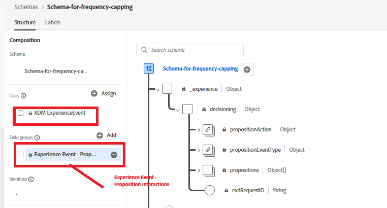
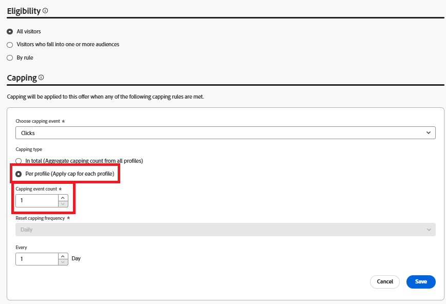
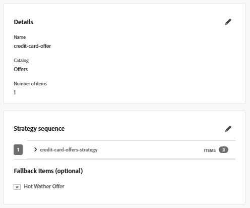
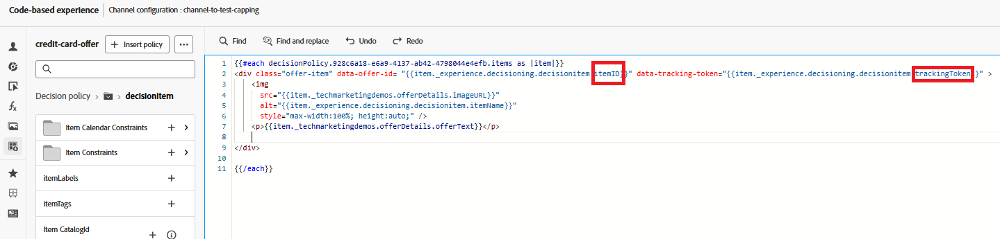

# AJO キャンペーンの頻度キャップを有効にする

オファーに頻度キャップを適用するには、次の手順を実行します。

## イベントスキーマの更新

* 次に示すように、フィールドグループを追加して、既存のイベントスキーマを更新します
* 

## オファーの頻度キャップを更新します

* 

## オファーにトラッキングトークンを追加

フォールバックオファーを追加して、キャンペーンで使用される決定ポリシーを編集します

トラッキングトークンとItemIDは、左側のナビゲーションの決定ポリシーアイコンをクリックし、決定ツリーをドリルダウンしてitemIDとtrackingTokenを選択することで追加できます。

次に示すように、アイテム IDとトラッキングトークンをオファーを含むdivに追加します

これにより、レンダリングされた各オファーにデータトラッキングトークンが含まれるようになり、正確なインプレッションとクリックイベントのトラッキングに不可欠です。

変更したキャンペーンをアクティブ化します。

## インプレッションおよびトラッキングイベントの送信

既存のJavaScript コードを変更して、オファーのインプレッションおよびインタラクションイベントをキャプチャし、Adobe Web SDKを使用してAdobe Experience Platformに送信します。 ここで提供されている[ サンプルコードを参照してください。](capture-impression-click-events.md)
