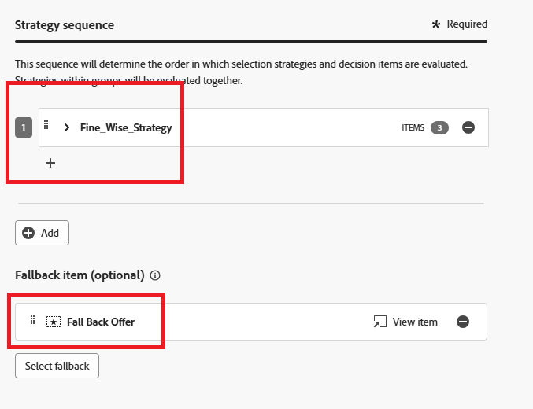

# 決定ポリシーの作成

決定ポリシーは、配信する最適なコンテンツをオーディエンスに応じて選択することを目的に、決定エンジンを活用するオファーのコンテナです。

パーソナライゼーションエディターで、左側のナビゲーションの「決定ポリシー」項目をクリックし、「決定ポリシーを追加」をクリックします。

「追加」をクリックして、選択戦略を選択します
「フォールバックを選択」をクリックして、フォールバックオファーを選択します。
「次へ」をクリックして決定ポリシーを確認し、「作成」をクリックして決定ポリシーの作成プロセスを完了します。

## コードエディターでの決定ポリシーの使用

パーソナライゼーションエディターで、「ポリシーを挿入」をクリックします。決定ポリシーに対応するコードが追加されます。

この段階では、必要な決定属性をコード内に直接含めることができます。 これらの属性は、オファーカタログで使用されるスキーマで定義されます。 標準属性は__エクスペリエンス名前空間の下に整理され、組織に固有のカスタム属性は `_<imsOrg>` 名前空間の下に保存されます。

このコードは、ユーザーに選択されたパーソナライズされたオファーのリストを処理し、web ページに各オファーのテキストを表示します。 このモードでは、段落内の各オファーからのメッセージ（offerText と呼ばれます）が表示されるので、ユーザーはカスタマイズされたコンテンツを明確に確認できます。
パーソナライズされたオファーがない場合は、フォールバックオファーが表示され、スペースが空白のままになりません。

「保存」をクリックして、キャンペーンを有効化します