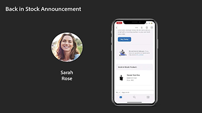

# Journey Optimizer のビデオとチュートリアル

Journey Optimizer は、企業が顧客に対して、連続性がありコンテキストに沿う、パーソナライズされたエクスペリエンスを提供するのに役立ちます。カスタマージャーニーとは、顧客がブランドと最初に接触してからサイトを離れるまでの間にブランドとやり取りする過程全体のことです。

このユーザーガイドには、Adobe Journey Optimizer の特長や機能に関するビデオとチュートリアルが含まれています。

## 最新情報

### チュートリアル

* **[メッセージ頻度ルールの設定](/help/administration/configure-frequency-rules.md)**

   *頻度ルールを作成、アクティブ化、テストおよびレポートする方法について説明します。 メッセージに継承する頻度ルールを決定する方法を説明します*

* **[サブスクリプションとランディングページ](/help/subscriptions-and-landing-pages.md)**

   *サブスクリプションを設定し、ランディングページを作成する方法について説明します。*

* **[パーソナライゼーションライブラリの保存済み式の使用と管理](/help/personalize-content/use-and-manage-saved-expressions-in-personalization-library.md)**

   *保存済みのパーソナライゼーションライブラリ項目をメッセージで使用する方法と、パーソナライゼーションライブラリ項目を作成および管理する方法について説明します。*

### Experience League ライブイベント

* **[Adobe Journey Optimizerでのプッシュ通知](https://experienceleague.adobe.com/docs/experience-league-live-events/events/episodes/exl-live-episode-05-12-22.html?lang=ja)**

   *このExperience Leagueライブエピソードでは、Adobe Journey Optimizerでのプッシュ通知の一般的な使用例について説明し、Adobe Experience Platformによるプッシュを使用するアプリの設定方法に関する技術的な詳細について説明します。*

## スタッフのおすすめ

<table>
<tr>
  <td>
    
    

      <a href="./introduction/journey-optimizer-overview-part-1.md">
    <strong>Journey Optimizer 概要 第 1 部 </strong>
    </a>
    

    

    <em>このビデオでは、企業が Adobe Journey Optimization を使用して、パーソナライズされたオムニチャネルジャーニーを消費者に提供する方法を示します。</em>
    

  </td>
    <td>
    
    

      <a href="./introduction/journey-optimizer-overview-part-2.md">
    <strong>Journey Optimizer 概要第 2 部  </strong>
    </a>
    

    

    <em>このビデオでは、企業がAdobe Journey Optimizerの意思決定管理機能、リアルタイムのセグメント認定、ビジネスイベント管理を使用して、コンシューマージャーニーを新たな高みに導く方法を示します。</em>
    

  </td>
  </td>
    <td>
    
    

      <a href="./decision-management/create-decisions.md">
    <strong>意思決定管理機能の概要 </strong>
    </a>
    

    

    <em>このビデオでは、意思決定管理機能が解決するビジネス上の課題、その主な機能、基本的なアーキテクチャ、主なユースケースについて説明します。

</em>
    

  </td>
</tr>
<tr>
  <td>
    
    

      <a href="./create-journeys/use-case-transactional-journey.md">
    <strong>ユースケース - トランザクションジャーニー </strong>
    </a>
    

    

    <em>トランザクションジャーニーに適用できる使用例を理解します。 トランザクションジャーニーを構築する方法と適用するベストプラクティスについて説明します。</em>
    

  </td>
    <td>
    
    

      <a href="./personalize-content/use-contextual-event-information-for-personalization.md">
    <strong>パーソナライゼーションに関するコンテキストイベント情報の使用 </strong>
    </a>
    

    

    <em>ジャーニーのコンテキストイベント情報を使用してメッセージをパーソナライズする方法を説明します。</em>
    

  </td>
  </td>
    <td>
    
    

      <a href="./report-and-monitor/live-and-global-reports.md">
    <strong>ライブレポートとグローバルレポート </strong>
    </a>
    

    

    <em>ライブレポートとグローバルレポートの違い、ジャーニーとメッセージ固有のレポートにアクセスして分析する方法およびレポートダッシュボードを変更する方法について説明します。

</em>
    

  </td>
</tr>
</table>
