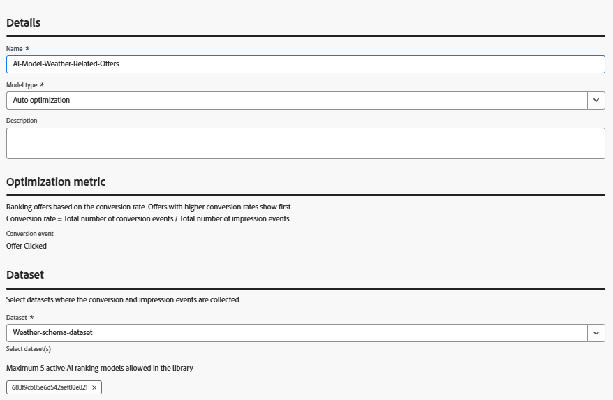
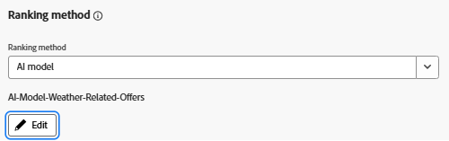

# AI モデルトレーニング用のAdobe Web SDKによるオファーインタラクションの取得

>[!NOTE]
>
> この記事は、Adobe Journey OptimizerのAIを利用したランキング手法を使用して、予測されるエンゲージメントにもとづいて表示されるオファーをパーソナライズする場合にのみ説明します。


この記事では、alloy （&quot;sendEvent,&quot; ...）を呼び出して、Adobe Experience Platform Web SDKを使用してオファーインタラクションイベント（インプレッションやクリックなど）をキャプチャする方法を説明します。 JavaScriptコードで直接指定します。 データはAEPに取り込まれ、Adobe Journey Optimizer（AJO）のAI モデルのトレーニングに使用されます。これにより、リアルタイムの行動にもとづいて、よりスマートなオファーランキングを実現できます。

Adobe Journey Optimizerでオファーランキング用のAI モデルを作成するには、データセットが提案インタラクション フィールドグループを含むスキーマに基づいている必要があります。 このフィールドグループは、decisioning.propositionDisplayやdecisioning.propositionInteractなどの主要な意思決定イベントと、involvedProposition、display、interactなどの必須フィールドをサポートしています。

これを実現するための有効なアプローチは2つあります。

- インタラクショントラッキング専用に設定された新しいスキーマ、データセット、データストリームを作成します
- 既存のスキーマを更新します。このチュートリアルで説明します


## 既存のスキーマを更新して、オファーインタラクションイベントを取得する

新しいスキーマを作成する代わりに、気象関連のオファーに使用される既存のエクスペリエンスイベントスキーマが更新され、インタラクショントラッキングがサポートされます。

Adobe Experience Platformで：

- 天気ベースのオファーに使用している既存の&#x200B;_**天気スキーマ**_ エクスペリエンスイベントスキーマを開きます。

- フィールドグループを追加します。
エクスペリエンスイベント – 提案インタラクション

新しいデータセットやデータストリームを作成する必要はありません。引き続き、既存の設定を天候オファーに使用してください。 送信されるイベントは、AI モデルのトレーニングとオファーのパフォーマンスのトラッキングに対するAdobe Journey Optimizerの期待に沿ったものです。


現在のデータセットを引き続き使用する（新しいデータセットを作成する必要はありません）

既存のデータストリームは既に設定されており、Adobe Experience Platform Tags プロパティで使用中です。変更は必要ありません。

Web SDKは、新しいインタラクションイベントを適切な宛先に自動的にルーティングします。

この合理化された設定により、あらゆる意思決定と天気のイベントを、単一の統合されたデータセットに取り込むことができます。これは、Adobe Journey OptimizerのAI モデルのトレーニングに最適です。


## オファー表示イベント（インプレッション）のキャプチャ

オファーのHTML構造が変更され、インタラクティブな要素（特に`<a>`および`<button>` タグ）が含まれるようになり、ユーザーがオファーにエンゲージできるようになりました（「オファーを請求」ボタンや「詳細」ボタンなど）。

各ボタンにはdata-offer-id属性が含まれているため、対応するインタラクションを適切に追跡できます。


ユーザーにオファーが表示されるタイミングを記録するために、天気オファーのレンダリングに使用される既存のJavaScript ファイルが更新され、表示イベントトラッキングが含まれるようになりました。

1つ以上のオファーが表示されたときに、Adobe Web SDK（alloy.sendEvent）を使用してdecisioning.propositionDisplay イベントが送信されるようになりました。 このイベントには、必要な表示：1個のフラグが含まれ、関連する提案を参照します。


```javascript
alloy("sendEvent", {
                    xdm: {
                      _id: generateUUID(),
                      timestamp: new Date().toISOString(),
                      eventType: "decisioning.propositionInteract",
                      identityMap: {
                        ECID: [{
                          id: ecidValue,
                          authenticatedState: "ambiguous",
                          primary: true
                        }]
                      },
                      _experience: {
                        decisioning: {
                          propositionEventType: {
                            interact: 1
                          },
                          propositionAction: {
                            id: offerId,
                            tokens: [trackingToken]
                          },
                          propositions: window.latestPropositions
                        }
                      }
                    }
                  });
```

## オファーのクリックイベントの取得（インタラクション）

ユーザーがオファーをクリックしたタイミングを追跡するために、既存のJavaScriptを更新し、オファーコンテナ内でレンダリングされた`<a>`と`<button>`の両方の要素のクリックをリッスンしました。

クリックが検出されると、Adobe Web SDKを使用してdecisioning.propositionInteract イベントが送信されます。 イベントには、必要なインタラクション：1のフラグが含まれ、特定のオファーIDと決定スコープを参照します。

```javascript
// Attach click tracking to <a> and <button> elements
child.querySelectorAll("a, button").forEach(el => {
                el.addEventListener("click", () => {
                  const ecidValue = getECID();
                  if (!ecidValue || !offerId || !trackingToken) {
                    console.warn("Girish!!!!  Missing ECID, offerId, or trackingToken. Interaction event not sent.");
                    return;
                  }

                  alloy("sendEvent", {
                    xdm: {
                      _id: generateUUID(),
                      timestamp: new Date().toISOString(),
                      eventType: "decisioning.propositionInteract",
                      identityMap: {
                        ECID: [{
                          id: ecidValue,
                          authenticatedState: "ambiguous",
                          primary: true
                        }]
                      },
                      _experience: {
                        decisioning: {
                          propositionEventType: {
                            interact: 1
                          },
                          propositionAction: {
                            id: offerId,
                            tokens: [trackingToken]
                          },
                          propositions: window.latestPropositions
                        }
                      }
                    }
                  });
                });
              });
```

## Adobe Journey Optimizer Offer Decisioningでのオファーランキング用AI モデルの作成

現在、web SDKを通じて取得され、Adobe Experience Platformに保存されているオファーのインプレッション数やクリック数を活用すれば、このデータを使用して、エンゲージメントを促進する可能性が最も高いオファーを予測するAI モデルをトレーニングできます。

このAI モデルは、ランキング式または選択戦略で参照され、各ユーザーに対して優先されるオファーを決定します。
- Journey Optimizerにログインします
- 決定/戦略設定/AI モデル/AI モデルの作成に移動します。
- 正しいデータセットを使用してください
  
- AI モデルを保存して有効化します。
- 前の手順で作成した選択戦略を更新して、ランキング方法にAI モデルを使用します
  

## 解決策をテスト

[既存のweb ページ ](assets/weather-offers.html)に[更新されたJavaScript ファイル ](assets/ai-model.js)を含めます
