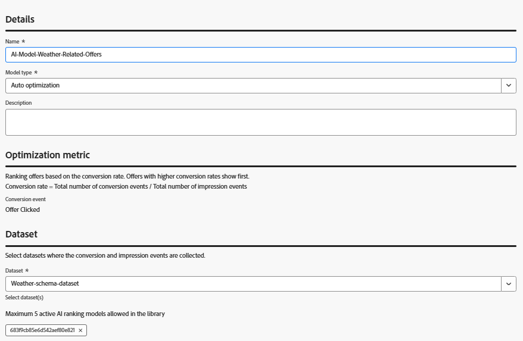

# AI モデルトレーニング用Adobe Web SDKとのオファーインタラクションのキャプチャ

>[!NOTE]
>
> この記事は、Adobe Journey Optimizerの AI ベースのランキングメソッドを使用して、予測されるエンゲージメントに基づいて表示するオファーをパーソナライズする予定がある場合にのみ参照してください。


この記事では、JavaScript コードで alloy （&quot;sendEvent,&quot;...）を直接呼び出し、Adobe Experience Platform web SDKを使用してオファーインタラクションイベント（インプレッション数やクリック数など）をキャプチャする方法について説明します。 データはAEPに取り込まれ、Adobe Journey Optimizer（AJO）の AI モデルのトレーニングに使用され、リアルタイムの動作に基づくよりスマートなオファーランキングが得られます。

Adobe Journey Optimizerでオファーランキングの AI モデルを作成するには、データセットが、提案インタラクション フィールドグループを含むスキーマに基づいている必要があります。 このフィールドグループは、involvedPropositions、display、interact などの必須フィールドと共に、decisioning.propositionDisplay や decisioning.propositionInteract などの主要な意思決定イベントをサポートしています。

これを行うには、次の 2 つの有効な方法があります。

- インタラクショントラッキング用に特別に設定された新しいスキーマ、データセット、データストリームを作成します
- 既存のスキーマを更新します。これは、このチュートリアルで行います。


## オファーインタラクションイベントをキャプチャするための既存スキーマの更新

新しいスキーマを作成する代わりに、天候関連のオファーに使用される既存のエクスペリエンスイベントスキーマを更新して、インタラクショントラッキングをサポートします。

Adobe Experience Platformで：

- 天気ベースのオファーに使用する既存の _&#x200B;**Weather-Schema**&#x200B;_ エクスペリエンスイベントスキーマを開きます。

- フィールドグループを追加します。
エクスペリエンスイベント – 提案インタラクション

新しいデータセットやデータストリームを作成する必要はありません。気象オファー用の既存の設定を引き続き使用します。 送信されるイベントは、AI モデルのトレーニングとオファーのパフォーマンスのトラッキングに対するAdobe Journey Optimizerの期待に沿ったものです。


現在のデータセットを使用し続けます（新しいデータセットを作成する必要はありません）

既存のデータストリームは、既に設定されており、Adobe Experience Platform タグのプロパティで使用されています。変更は必要ありません。

Web SDKは、新しいインタラクションイベントを適切な宛先に自動的にルーティングします。

この合理化された設定により、すべての意思決定と天候のイベントが、1 つの統合データセットに取り込まれるので、Adobe Journey Optimizerでの AI モデルのトレーニングに最適です。


## オファー表示イベント（インプレッション）のキャプチャ

インタラクティブな要素（特に `<a>` タグと `<button>` タグ）を含むようにオファーのHTML構造を変更し、ユーザーがオファーを操作できるようにします（「オファーを要求」や「詳細情報」ボタンなど）。

各ボタンには data-offer-id 属性が含まれているので、対応するインタラクションを適切に追跡できます。


オファーがユーザーに表示されたタイミングをログに記録するために、天気予報オファーのレンダリングに使用される既存のJavaScript ファイルが、表示イベントトラッキングを含むように更新されました。

1 つ以上のオファーが表示される場合、Adobe web SDK（alloy.sendEvent）を使用して decisioning.propositionDisplay イベントが送信されるようになりました。 このイベントには、必要なディスプレイである 1 フラグが含まれており、関連する提案を参照します。


```javascript
alloy("sendEvent", {
                    xdm: {
                      _id: generateUUID(),
                      timestamp: new Date().toISOString(),
                      eventType: "decisioning.propositionInteract",
                      identityMap: {
                        ECID: [{
                          id: ecidValue,
                          authenticatedState: "ambiguous",
                          primary: true
                        }]
                      },
                      _experience: {
                        decisioning: {
                          propositionEventType: {
                            interact: 1
                          },
                          propositionAction: {
                            id: offerId,
                            tokens: [trackingToken]
                          },
                          propositions: window.latestPropositions
                        }
                      }
                    }
                  });
```

## オファークリックイベント（インタラクション）のキャプチャ

ユーザーがオファーをクリックしたタイミングを追跡するために、オファーコンテナ内でレンダリングされた `<a>` 要素と `<button>` 要素の両方のクリックをリッスンするように既存のJavaScriptを更新しました。

クリックが検出されると、decisioning.propositionInteract イベントが、Adobe Web SDKを使用して送信されます。 イベントには、必要なインタラクション：1 フラグが含まれ、特定のオファー ID と決定範囲を参照します。

```javascript
// Attach click tracking to <a> and <button> elements
child.querySelectorAll("a, button").forEach(el => {
                el.addEventListener("click", () => {
                  const ecidValue = getECID();
                  if (!ecidValue || !offerId || !trackingToken) {
                    console.warn("Girish!!!!  Missing ECID, offerId, or trackingToken. Interaction event not sent.");
                    return;
                  }

                  alloy("sendEvent", {
                    xdm: {
                      _id: generateUUID(),
                      timestamp: new Date().toISOString(),
                      eventType: "decisioning.propositionInteract",
                      identityMap: {
                        ECID: [{
                          id: ecidValue,
                          authenticatedState: "ambiguous",
                          primary: true
                        }]
                      },
                      _experience: {
                        decisioning: {
                          propositionEventType: {
                            interact: 1
                          },
                          propositionAction: {
                            id: offerId,
                            tokens: [trackingToken]
                          },
                          propositions: window.latestPropositions
                        }
                      }
                    }
                  });
                });
              });
```

## Adobe Journey Optimizer Offer Decisioningでオファーランキング用の AI モデルを作成

オファーのインプレッション数とクリック数は、Web SDKを介して取得され、Adobe Experience Platformに保存されるようになりました。このデータを使用すると、エンゲージメントを促進する可能性が最も高いオファーを予測する AI モデルをトレーニングできます。

この AI モデルは、ランキング式または選択戦略で参照され、各ユーザーに対して優先度が設定されているオファーを決定します。
- Journey Optimizerにログインします
- 決定/戦略の設定/AI モデル/AI モデルを作成に移動します。
- 正しいデータセットを使用していることを確認します
  
- AI モデルを保存して有効化します。
- ランキング方法に AI モデルを使用するには、前の手順で作成した選択戦略を更新します
  

## ソリューションのテスト

[&#x200B; 既存の web ページ &#x200B;](assets/ai-model.js) に [&#x200B; 更新されたJavaScript ファイル &#x200B;](assets/weather-offers.html) を含める
