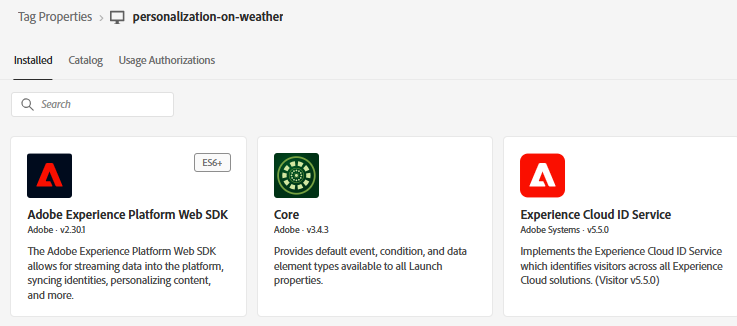
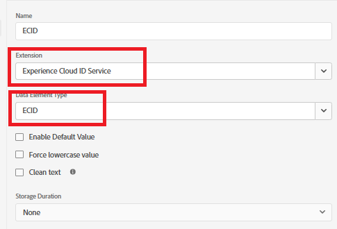
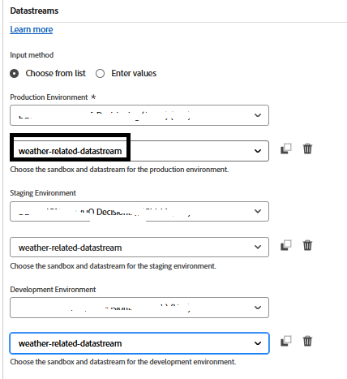
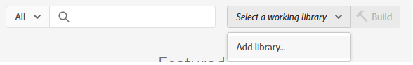
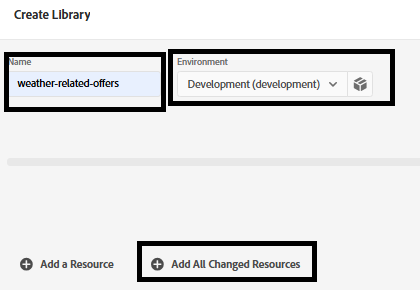

# Adobe Experience Platform タグの作成

Adobe Experience Platform Tags （旧Adobe Launch）を使用すれば、サイトのコードを変更することなく、マーケティングおよび分析テクノロジーをweb サイトに管理およびデプロイできます。

この[&#x200B; ビデオでは、Adobe Experience Tags](https://experienceleague.adobe.com/en/playlists/experience-platform-get-started-with-tags)の作成手順について説明します

* データ収集にログイン
* 「_&#x200B;**タグ ->新規プロパティ**」をクリックします
* _&#x200B;**personalization-on-weather**&#x200B;_&#x200B;という名前のAdobe Experience Platform タグを作成します。
* タグに次の拡張機能を追加します

* 次に示すように、「ECID」というデータ要素を追加します。 このデータ要素は、後でレポートで使用します

* 正しい環境と、前の手順で作成した&#x200B;**気象関連のデータストリーム**&#x200B;を使用するように、Adobe Experience Platform Web SDKを設定してください。

## AEP タグのビルドとデプロイ

以下のスクリーンショットに示すように、新しいライブラリを作成し、変更されたすべてのリソースをそれに追加します。

**ライブラリを追加**

**ライブラリの作成**

ライブラリの作成画面で、ライブラリ名と環境を指定します。

変更されたすべてのリソースをこのライブラリに追加する

次に、「保存して開発用にビルド」ボタンをクリックして、ライブラリをビルドします

## HTML ページにAEP タグを含める

AEP Tags プロパティを公開すると、AdobeはHTML ` <head>`内または` <body>` タグの下部に配置する必要があるスクリプトタグを提供します。

1. Tags （personalization-on-weather） プロパティに移動します。
2. 「環境」をクリックし、必要な環境（開発、ステージング、実稼動など）のインストールアイコンをクリックします。
3. 埋め込まれたコードをメモします。 このチュートリアルの後半の段階で必要になります。
