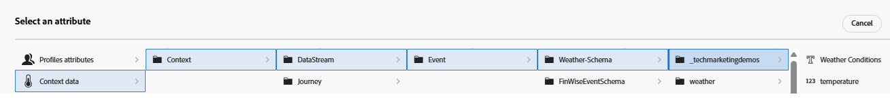

# ランキング式を作成

Adobe Journey Optimizerのランキング式は、Offer Decisioning の実行中、特に選択戦略内で使用され、実施要件を満たすオファーの優先順を決定します。 ランキング式は、実施要件フィルタリングの後に、特定のプロファイルに対して複数のオファーが適合するが、ビジネスロジックまたはプロファイルコンテキストに基づいて上位 1 つ（または少数）のみを提示する必要がある場合に有効になります。

* Journey Optimizerにログインします

* 決定/戦略の設定/ランキング式/式を作成

式に「天気 – 関連 – オファー _**という名前を付け**_

ランキング式の条件とは、オファーにスコアを割り当てるために使用される条件付きルールを指します。 これらの条件では、オファーの属性とコンテキストを比較して、特定の個人に対するオファーの関連度を判断します。

次の 3 つの条件を定義して、オファーをフィルタリングし、資格のあるオファーにランキングスコアを割り当てます。 条件は、条件ビルダーを使用して定義します。 コンテキストデータは、以下のスクリーンショットに示すように、条件の定義にも使用できます

3 つの条件はすべて、条件の定義にオファー属性（タグ）とコンテキストデータ属性（温度）を使用しました。

## 条件 1

| **オファータグ** | **コンテキストデータの条件** | **スコアのロジック** |
|------------------|---------------------|-------------------------------------|
| **ホット** | 体温 > 80 | score=Temperature |

## 条件 2

| **気象タグ** | **コンテキストデータの条件** | **スコアのロジック** |
|------------------|---------------------------|----------------------------------------------|
| **春** | 体温 > 65 かつ &lt; 80 | score=temperature × 4 |

## 条件 3

| **気象タグ** | **コンテキストデータの条件** | **スコアのロジック** |
|------------------|---------------------------|----------------------------------------------|
| **コールド** | 温度 &lt; 65 | スコア =温度 |
