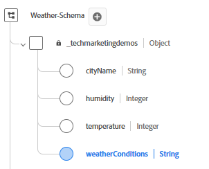
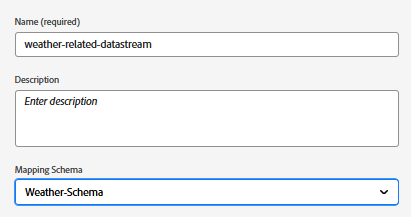
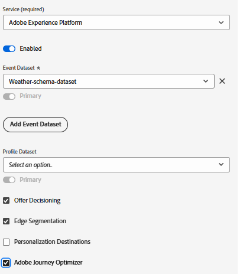

# AEPでのXDM スキーマ、データセットおよびデータストリームの設定

## XDM スキーマの作成

Web ページでAdobe Experience Platform Web SDK（Alloy.js）を使用するには、XDM イベントスキーマにマッピングされたデータストリームにAEP タグを関連付ける必要があります。 Web SDK（alloy.sendEvent）は、データをExperience EventsとしてAEPに送信します。これは、XDM ExperienceEvent クラスに基づくXDM スキーマに準拠する必要があります。

XDM スキーマを作成するには

- Adobe Experience Platformにログインします
- _**データ管理/ スキーマ / スキーマの作成**_&#x200B;に移動します

- **_Weather-Schema_**&#x200B;という名前のXDM イベントベースのスキーマを作成します。 スキーマの作成に慣れていない場合は、この[ ドキュメント ](https://experienceleague.adobe.com/en/docs/experience-platform/xdm/tutorials/create-schema-ui)に従ってください

- スキーマに、適切なデータタイプを持つ次のフィールドがあることを確認します。

- 

- フィールドグループ _**Web詳細**_&#x200B;をスキーマに追加します。 このフィールドグループは、レポートの目的で必要です。

## スキーマに基づくデータセットの作成

Adobe Experience Platform （AEP） **の** データセットは、定義されたXDM スキーマに基づいてデータを取り込み、保存、アクティブ化するために使用される構造化ストレージコンテナです。

- _**データ管理/ データセット / データセットの作成**_&#x200B;に移動します
- 前の手順で作成したXDM スキーマ（_**Weather-Schema**_）に基づいて、**_Weather-schema-dataset_**&#x200B;というデータセットを作成します。

## データストリームの作成

Adobe Experience Platformのデータストリームは、web サイトやアプリとAdobe サービスを結ぶ安全なパイプライン（高速道路）のようなもので、データを流し込み、パーソナライズされたコンテンツを元に戻すことができます。

- _**データ収集/ データストリーム**_&#x200B;に移動し、「新しいデータストリーム」をクリックします。 データストリーム **weather-related-datastream**&#x200B;に名前を付けます

- 以下のスクリーンショットに示すように、次の詳細を入力します
  
- 「保存」をクリックし、「マッピングを追加」をクリックして、適切なチェックボックスを選択したAdobe Experience Platform サービスとイベントデータセットを追加します
  

- データストリームを保存します。

>[!NOTE]
>
>新しく作成されたデータセットは、ランキング式またはPersonalization エディターで選択できるようになるまでに最大24時間かかる場合があることに注意してください。
