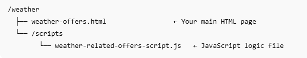

# 解決策をテスト

ソリューションをエンドツーエンドでテストするには、[weather-offers.zip]からweather-offers.htmlおよびweather-related-offers-script.jsを抽出します。（assets/weather-offers.zip）これらのファイルは、web サーバーまたはGithub Pagesなどのパブリックホスティングサービスでホストする必要があります。 これは次の理由から必要です。
- ブラウザーの位置情報APIは、HTTPSまたはlocalhostでのみ動作します

整理整頓し、相対パスが正しく機能することを確認するために、このソリューションをホストする次のフォルダー構造をお勧めします。



## 提供されたファイルをダウンロード

[weather-offers.zip]からHTMLとJavaScript ファイルをダウンロードして抽出します。（assets/weather-offers.zip）


## JavaScript ファイルのサーフェス URLを更新します

`weather-related-offers-script.js`を開き、` "web://yourdomain.com/weather/weather-offers.html#offerContainer"`を更新します。ただし、`yourdomain.com`は、HTML ファイルがホストされている実際のドメインに置き換えます。

## Adobe Experience Platform Tags プロパティの更新

テキストエディターでweather-offers.html ファイルを開き、このチュートリアルの前の手順で作成したAdobe Experience Platform タグプロパティのスクリプトタグにスクリプトタグを置き換えます。 必ずファイルを保存してください

```
<script src="https://assets.adobedtm.com/AEM_TAGS/launch-ENabcd1234.min.js" async></script>
```

## web ページの機能

web ページは、リアルタイムの温度データを使用して、コンテキストに即したオファーのパーソナライゼーションをテストするために構築されています。 ユーザーがページにアクセスすると、ブラウザーは位置情報へのアクセスを求めます。 承認されると、ページはOpenWeatherMap APIを介して温度、状態、都市などの現在の気象の詳細を取得します。 このコンテキストデータはユーザーに表示され、Adobe Web SDK（Alloy）を使用してAdobe Experience Platformに送信されます。

sendEvent呼び出しはrenderDecisions:falseで設定され、Adobe Journey Optimizerから返されるオファーは手動で処理されます。 スクリプトは、決定応答を処理し、コンテンツをデコードし、最も関連性の高いオファーを指定されたコンテナ（#offerContainer）に動的に挿入します。

## JavaScriptの機能

JavaScriptは、ユーザーの場所に基づいて気象情報を動的に取得し、Adobe Experience Platform（AEP）を使用してパーソナライズされたオファーを配信します。 手順の内訳を次に示します。

1. **合金の読み込み待ち**

   このスクリプトを使用すると、パーソナライゼーションリクエストを行う前に、Adobe Web SDK（Alloy）が完全に読み込まれます。

2. **ユーザーの場所を取得**

   ブラウザーのGeolocation APIを使用して、ユーザーの現在の緯度と経度を取得します。

3. **天気データを取得**

   OpenWeatherMap APIを呼び出して、現在の天気の詳細を取得します。

   温度（単位：°F）

   気象条件（例：「雨」、「クリア」）

   都市名

   湿度

4. **Web ページに天気情報を表示**

   次のようなメッセージでDOMを更新します。

   &quot;現在のサンディエゴの気温は72°Fで、晴れた空が見られます。&quot;

5. **天気予報をAEPに送信**

   alloy （&quot;sendEvent&quot;）を使用して、コンテキストに沿った気象データをAEPに送信します

   ```javascript
   xdm: {
   eventType: "decisioning.request",
   _techmarketingdemos: {
   temperature: temp,
   weatherConditions: condition,
   cityName: city
     }
   }
   ```

6. **オファーの取得とレンダリング**

* AJO Decisioningから返されたオファーを受け取ります。

* HTML コンテンツをデコードします。

* オファーをに動的に挿入 <div id="offerContainer"> 要素にオファーコンテンツが返されます。

## 次の手順

[AJO Decisioningの影響を測定および報告。](https://experienceleague.adobe.com/en/docs/journey-optimizer/using/decisioning/experience-decisioning/cja-reporting)

