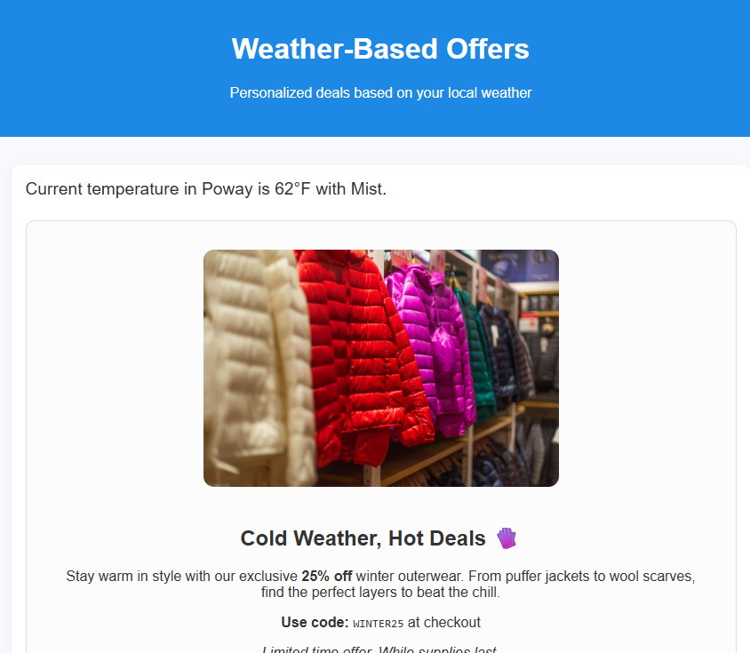

# ユースケースの説明

Adobe Journey Optimizer（AJO）の気象関連データを活用したオファーにより、実際のリアルタイムの環境条件にもとづいて顧客体験をパーソナライズできます。 天候は、コンテクストを示す強力なシグナルです。 人々のニーズや行動は、天候に応じて変化します。 気象データを利用する：

顧客のムードや環境に合わせた適切なオファーを提供します

暑い日には、冷たい飲み物やAC ユニットのオファーを示します。 雨の日には、上着や傘を宣伝しましょう

天候に応じたオファーの例

## このチュートリアルの前提条件

* Experience Platformへのアクセス：

* Adobe Experience Platform Tagsの基本。

* Experience Platformの基本コンセプト（プロファイル、オーディエンス、データセット）。

* Journey Optimizerの詳細。

* JavaScriptの基本的な知識（簡単な関数の読み取りと書き込み）。

* ブラウザー開発ツール （コンソールおよびネットワークタブ）の使用機能。
