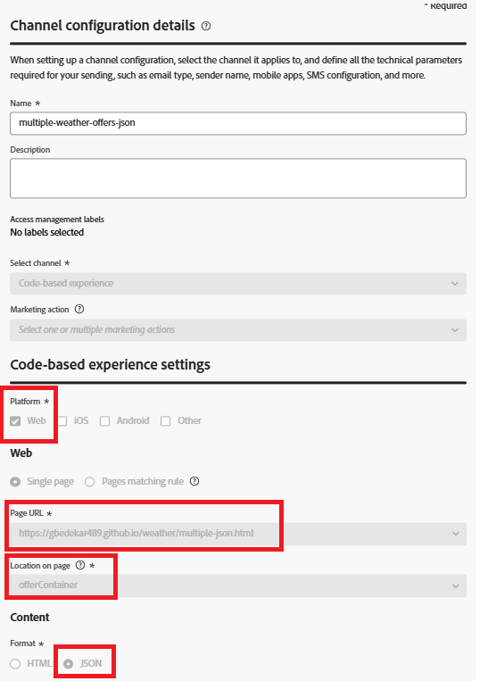
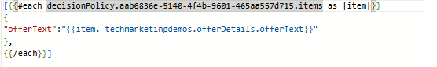

# Adobe Journey OptimizerのJSON コンテンツを使用したPersonalizationの提供

このセクションは、フロントエンドでのオファーのレンダリング方法をより詳細に制御したい上級ユーザー向けの追加リソースとして提供されます。

コードベースのエクスペリエンス（CBE）でJSON コンテンツタイプを使用すると、構造化オファーデータを返し、JavaScriptを使用してレンダリングを動的に処理できます。 JSON コンテンツタイプは、カスタムレイアウト、条件付きロジック、天候、場所、デバイスタイプなどのコンテキストデータとの統合が必要なシナリオで特に便利です。

基本的なオファーの提供には必須ではありませんが、このアプローチは、標準的なHTMLレンダリングの機能を超えて、パーソナライズされたデータ主導型のエクスペリエンスを構築する柔軟性を開発者に提供します。

## JSON コンテンツタイプを使用したコードベースエクスペリエンス（CBE）の作成。

まず、Adobe Journey Optimizerで新しいコードベースエクスペリエンス（CBE）を作成し、コンテンツフォーマットをJSONに設定します。 コンテンツタイプは、AJOに対して、構造化オファーデータ（offerText、画像、メタデータなど）をレンダリングされたHTMLではなくJSON オブジェクトとして返すように指示します。 プラットフォーム（webなど）、オファーが表示されるターゲット URL、ページ上の場所（offerContainerなどのコンテナ ID）を定義します。 この設定により、web アプリケーションはオファーデータを受け取り、JavaScriptを使用して動的にレンダリングできるようになります。



## CBEとキャンペーンの決定ポリシーの関連付け

JSON コンテンツタイプを持つコードベースエクスペリエンス（CBE）を作成すると、決定ポリシーを介してキャンペーンにリンクされます。 決定ポリシーは、プロファイルまたはコンテキストデータに基づいて、オファーの適格性、ランキング、配信のロジックを定義します。

決定ポリシーをPersonalization エディターに挿入する場合（アプリ内メッセージや電子メールなど）、出力が有効なJSON構造を維持していることを確認することが重要です。

キャンペーン内のPersonalization Editor （PE）にDecision Policyを挿入すると、Adobe Journey Optimizerは、選択したポリシーに基づいてHandlebars ループを自動的に生成します。 次に例を示します。

このループは、ポリシーによって返されたすべての決定項目を繰り返し処理し、各オファーからofferText フィールドを挿入します。 このデフォルトの構造は、HTML コンテンツタイプで適切に機能しますが、JSON コンテンツを使用する場合、特に結果がプログラムで解析されている場合は、有効なJSON配列またはオブジェクトを生成するために再構築が必要になる場合があります。



このHandlebars テンプレートは、オファーオブジェクトのJSON配列を出力するように設計されており、各オブジェクトには1つのofferText フィールドが含まれています。 指定された決定ポリシーによって返された決定項目をループし、各offerTextをJSON オブジェクト形式でラップします。

## JSON オファー応答を解析

AJOからの応答には、`propositions[].items[].data.content[]`構造下にパーソナライズされた決定項目がJSON形式で含まれています。 各コンテンツ項目には、offerTextなどのフィールドが含まれます。

```javascript
(response.propositions || []).forEach(p => {
  (p.items || []).forEach(item => {
    const contents = item.data?.content || [];
    contents.forEach(contentItem => {
      const html = contentItem.offerText || "";
      const wrapper = document.createElement("div");
      wrapper.className = "offer";
      wrapper.innerHTML = html;
      document.getElementById("offerContainer").appendChild(wrapper);
    });
  });
});
```

### サンプルアセット

まずは、サンプルのHTML ファイルとJavaScript ファイルをダウンロードして、JSON ベースのオファーを使用し、web ページ上で動的にレンダリングする方法を確認してください。

[JavaScript コード](assets/weather-related-offers-script-multiple-json.js)
[HTML ファイル ](assets/multiple-json.html)
