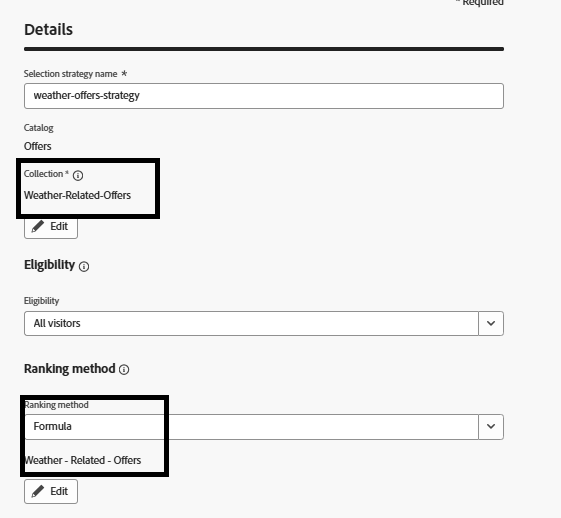

# 選択戦略の作成

選択戦略は、オファーのコレクションと適格性ルールおよびランキング方法を組み合わせて、戦略が決定ポリシーで使用されるときに表示されるオファーを決定する再利用可能な設定です。

選択戦略を作成するには

* Journey Optimizerにログインします

* _&#x200B;**決定 – >戦略設定 – >選択戦略 – >選択戦略の作成**&#x200B;_&#x200B;に移動します

* スクリーンショットに示すように、選択戦略名、コレクション、適格性、ランキング方法を指定します

ランキング方法として数式を使用してください

