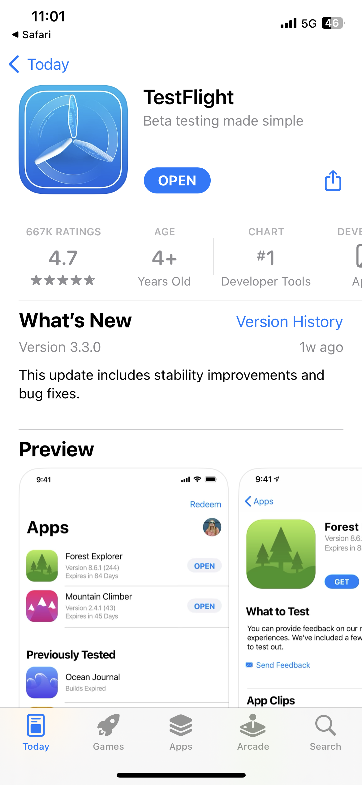

# サミットラボ L731- チートシート

このページには、L731 Summit Lab で使用されているテキストとリンクが含まれています。 これらを使用して、コンテンツをコピーし、Journey Optimizerメッセージに貼り付けることができます。

## 演習 1.1 - アプリのダウンロードとインストール

QR コードをスキャンしてアプリをダウンロード

>[!BEGINTABS]

>[!TAB iOS]

Testflight のインストールを求められます（手順 1 ～ 4）。 Testflight をインストールしたら、手順 5～8 に従って Vegas Stay App をインストールします。

<table>
<tr>
</tr>
<tr>
<td>
 

      

      <b>手順 1 </b>
      

      
      

  </td>
  <td>
 

      

      <b>手順 2 </b>
      

      
      

  </td>
  <td>
 

      

      <b>手順 3 </b>
      

      
      

  </td>
  <td>
 

      

      <b>手順 4 </b>
      

      
      

  </td>
  </tr>
  <tr>
<td>
 

      

      <b>手順 5 </b>
      

      
      

  </td>
  <td>
 

      

      <b>手順 6 </b>
      

      
      

  </td>
  <td>
 

      

      <b>手順 7 </b>
      

      
      

  </td>
  <td>
 

      

      <b>手順 8 </b>
      

      
      

  </td>
  </tr>
</table>
&gt;[!TAB Android]

Android シミュレーターを使用している場合は、次のリンクを使用します。 [https://ajolab.s3.amazonaws.com/ajolabapp-release.apk](https://ajolab.s3.amazonaws.com/ajolabapp-release.apk)

アプリがGoogle Play Store に登録されていないので、次の警告メッセージが表示されます。

クリック **インストール**

>[!ENDTABS]

## 演習 1.3：Adobe Journey Optimizer へのログイン

[Journey Optimizer にログインするには、こちらをクリックしてください](https://experience.adobe.com/#/@techmarketingdemos/sname:summit-2023-ajo-lab/journey-optimizer/home)

**ログインの詳細：**

* **ユーザー名：** `L731+<your seat number>@summitlab.us` ( 例：L731+001@summitlab.us)
* **パスワード：** Adobe2023!

## 演習 2.1：アプリ内キャンペーンの作成

| フィールド | テキスト | リンク |
|----|----|----|
| キャンペーン名 | `<your seat number> March Vegas Campaign` |  |
| マッチャー | 今すぐ予約 |  |
| メディア URL オプション |  | https://mcfadyen.com/wp-content/uploads/2023/01/Adobe-Summit-2023-Banner.png |
| タイトル | それは起こっていて、それはライブです！ |  |
| 本文 | Adobe Summit が 2023年3月21日～23日 にラスベガスに戻ってきます。 刺激的な講演者やスキルを高めるセッション、新しい人脈作りに備えましょう。 |  |
| ボタン | 今すぐホテルを予約すれば 10％割引 | lab://booking?suite=presidential&amp;discount=10 |
| ボタン：インタラクティブイベント | アプリ内 CTA |  |
| ベース URL |  | iOS:lab://  Android&amp;:https://lab |

## レッスン 3：オムニチャネルジャーニーの作成

**ジャーニーラベル：**
`<your seat number>`  — ようこそジャーニー

>[!BEGINTABS]

>[!TAB プッシュメッセージ]

**ラベル：**
お知らせメッセージ

**タイトル:**\
ベガスステイへようこそ。

**本文:**\
列に並ばずにモバイルアプリでチェックイン

**ディープリンク：** lab://checkin

**メディア:**

https://experienceleague.adobe.com/docs/journey-optimizer-learn/assets/vegas_online_check_in.jpg?lang=en

プッシュ通知に使用する画像は次のとおりです。

>[!TAB SMS メッセージ]

**ラベル：**
お知らせメッセージ

**メッセージ：**
ベガスステイへようこそ。 列に並ばずにモバイルアプリでチェックイン：lab://checkin

>[!TAB 電子メールメッセージ]

**ラベル：**
確認メッセージ

**件名：**
{{profile.person.name.firstName}}チェックイン済みです。今すぐ滞在のオファーを確認してください。

>[!ENDTABS]
