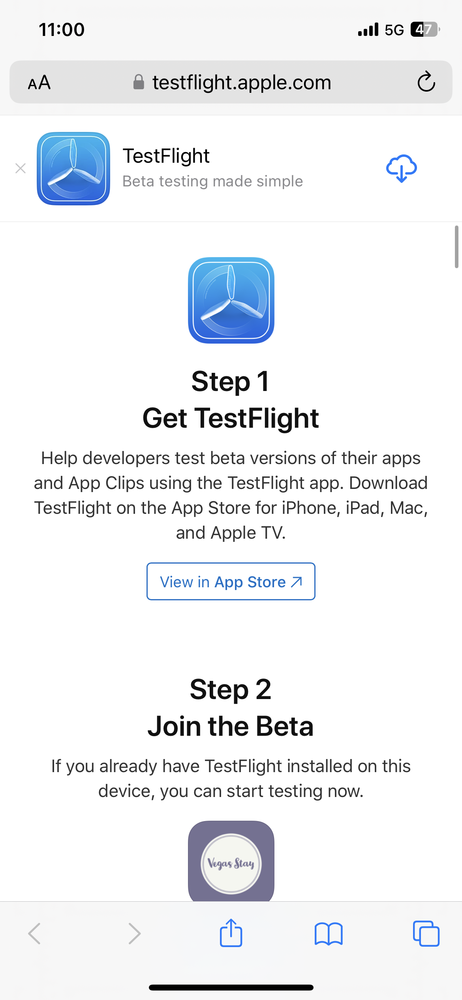
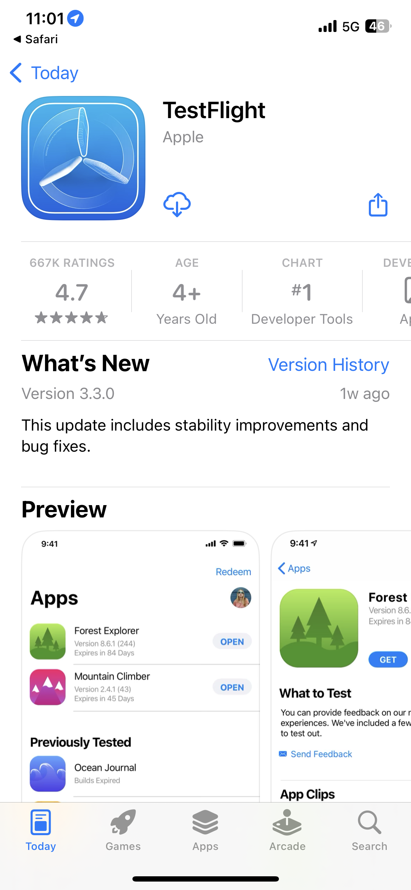
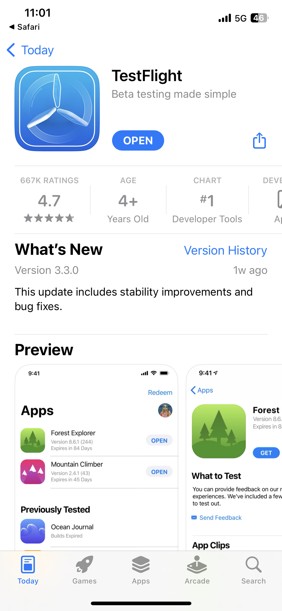
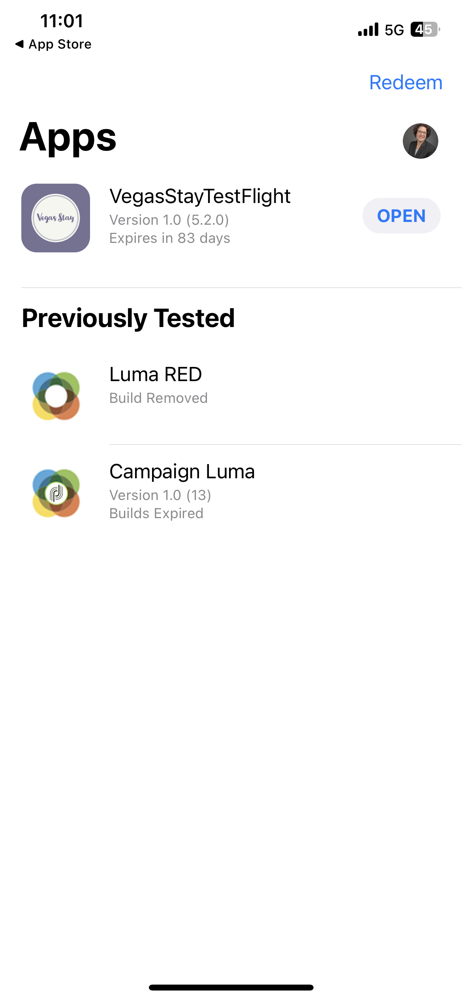

# Summit Lab L731 - チートシート

このページには、L731 Summit Lab で使用されているテキストとリンクが含まれています。 これらを使用して、コンテンツをコピーし、Journey Optimizerメッセージに貼り付けることができます。

## 演習 1.1 - アプリのダウンロードとインストール

QR コードをスキャンしてアプリをダウンロード

>[!BEGINTABS]

>[!TAB iOS]

>[!IMPORTANT]
>
>引き換えコードを求められた場合は、TestFlight アプリを閉じて、もう一度 QR コードをスキャンしてください。
>
>通知を許可してください。
>

Testflight のインストールを求められます（手順 1～4）。 Testflight をインストールしたら、手順 5～8 に従って Vegas Stay アプリをインストールします。

<table>
<tr>
</tr>
<tr>
<td>
 

      

      <b>手順 1 </b>
      

      
      

  </td>
  <td>
 

      

      <b>手順 2 </b>
      

      
      

  </td>
  <td>
 

      

      <b>手順 3 </b>
      

      
      

  </td>
  <td>
 

      

      <b>手順 4 </b>
      

      
      

  </td>
  </tr>
  <tr>
<td>
 

      

      <b>手順 5 </b>
      

      
      

  </td>
  <td>
 

      

      <a>
      <b>手順 6</b>
      

        
      </a>
      

  </td>
  <td>
 

      

      <a>
      <b>手順 7 </b>
      

        
      </a>
      

  </td>
  <td>
 

      

      <a>
      <b>手順 8 </b>
      

        
      </a>
      

  </td>
  </tr>
</table>

>[!TAB Android]

アプリが Google Play ストアに登録されていないので、次の警告メッセージが表示されます。

「**とにかくインストールする**」をクリックします

>[!ENDTABS]

## 演習 1：Adobe Journey Optimizer へのログイン

[Journey Optimizer にログインするには、こちらをクリックしてください](https://experience.adobe.com/#/@techmarketingdemos/sname:summit-2023-ajo-lab/journey-optimizer/home){target="_blank"}

**ログインの詳細**

* **ユーザー名：** `L731+<your seat number>@summitlab.us`（例：L731+001@summitlab.us）
* **パスワード：** Adobe2023!

## 演習 2：アプリ内キャンペーンの作成

| セクション | フィールド | テキスト | リンク |
|----|----|----|----|
| **プロパティ** | キャンペーン名 | `<your seat number> Vegas Stay Campaign` |  |
| **トリガー** | 都道府県 | 今すぐ予約 |  |
| **コンテンツを編集：**&#x200B;メディア | メディア URL オプション |  | https://i.ibb.co/NstLhjW/Firefly-Poster-with-heading-Adobe-Max-84773.jpg |
| **コンテンツを編集：**&#x200B;コンテンツ | タイトル | 早期ディスカウントを入手 |  |
| **コンテンツを編集：**&#x200B;コンテンツ | 本文 | Adobe Max がラスベガスに戻ってきます。 刺激的な講演者やスキルを高めるセッション、新しい人脈作りに備えましょう。 今すぐスイートを予約すると 10％オフになります。 |  |
| **コンテンツを編集：**&#x200B;ボタン | ボタン | 10％ディスカウントを入手 | lab://booking?suite=presidential&amp;discount=10 |
| **コンテンツを編集：**&#x200B;ボタン | インタラクトイベント | アプリ内 CTA |  |
| **デバイスでのプレビュー** | デバイス上でのプレビューに使用するベース URL |  | **iOS：** lab://  **Android**：https://lab |

## 演習 3：プッシュ通知の作成

| フィールド | テキスト | リンク |
|----|----|----|
| キャンペーン名 | **`<your seat number> Max Push Campaign`** |  |
| タイトル | こんにちは |  |
| 本文 | Adobe Max がラスベガスに戻ってくることをご存知ですか。 今すぐ部屋を予約すると 10％ディスカウントになります。 |  |
| メディア URL オプション |  | https://i.ibb.co/1M0BnZn/Firefly-Big-conference-big-stage-with-ADBE-text-on-screen-40178.jpg |
