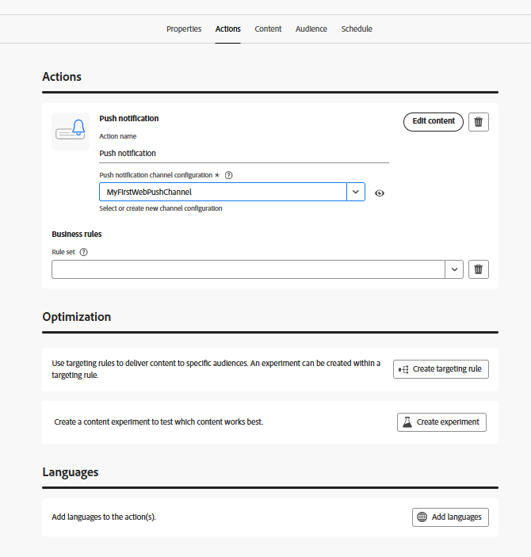
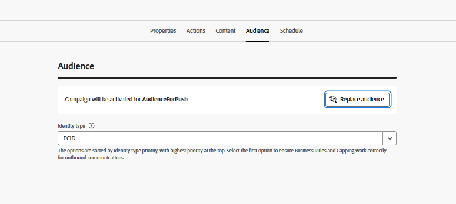

# キャンペーンを作成

この手順では、Adobe Journey Optimizerでキャンペーンを作成し、オプトインしたユーザーにスケジュール済みのweb プッシュ通知を送信します。 このキャンペーンは、適格なオーディエンスをターゲットとし、事前に定義された時間にメッセージを配信することで、計画されたオーディエンスベースのエンゲージメントを可能にします。

* Journey Optimizerにログインします
* ジャーニー管理に移動| キャンペーン | キャンペーンの作成

## キャンペーン設定の指定

キャンペーン名の指定

## アクションをキャンペーンに関連付ける

このチュートリアルで先ほど作成したプッシュチャネル設定を関連付けます

## オーディエンスをキャンペーンに関連付ける

オーディエンス `AudienceForPush`をキャンペーンに関連付ける

## プッシュ通知用のコンテンツの作成

プッシュ通知をテストするための基本的なプッシュコンテンツを作成します。 次に示すように、メッセージのタイトルと本文を指定します

## キャンペーンのスケジュール

ニーズに応じてキャンペーンをスケジュールし

最後に、キャンペーンをアクティブ化します。

## キャンペーンのテスト

キャンペーンをテストするには、最初にメッセージが表示されたら](http://localhost:3000)をオプトインして、[web ページで通知を有効にします。 オプトインしたら、キャンペーンがスケジュールされた時間に実行されるのを待ちます。 キャンペーンが実行されると、ブラウザーにプッシュ通知が届きます。
