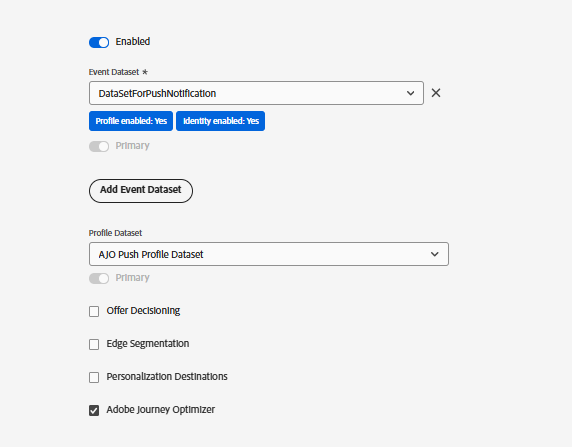

# データストリームを作成

Adobe Experience Platform（AEP）のデータストリームは、Web SDKから送信されたデータを受け取るエンドポイントとして機能します。 このデータは、AEP、Adobe Analytics、Adobe Journey Optimizerなどの設定済みサービスにルーティングされます。 このチュートリアルでは、データストリームを使用して、web プッシュのサブスクリプションデータとprice.drop イベントをAEPに送信し、アクティベーションします。

## プッシュ通知を追跡するためのイベントスキーマの作成

`SchemaForPushNotification`という名前の新しいXDM ExperienceEvent スキーマを作成します。 このスキーマに`Push Notification Tracking`および`Commerce Details` フィールドグループを追加します。 Commerceの詳細フィールドグループのフィールドを使用して、商品情報を取得し、price.drop カスタムイベントをトリガーします。

## プロファイルスキーマを作成してユーザーの同意を保存する

このチュートリアルでは、標準の`AJO Push Profile Schema`を使用します。 このスキーマは、web プッシュ通知の配信に必要なプッシュトークンを含む、ユーザーのプッシュ購読の詳細を保存します。

## スキーマのデータセットの作成

以前に作成したイベントスキーマを使用して、`DataSetForPushNotification`という名前のデータセットを作成します。 プロファイルデータの場合は、プッシュプロファイルスキーマに関連付けられている、標準の`AJO Push Profile Dataset`を使用します。 チュートリアルの後半で.env ファイルを使用してアプリケーションを設定する際に必要になるので、`DataSetForPushNotification` IDをメモしてください。

## イベントおよびプロファイルデータセットを使用したデータストリームの作成

前の手順で作成したイベントおよびプロファイルデータセットを使用して、WebPushDataStreamという名前の新しいデータストリームを作成します。 チュートリアルの後半で.env ファイルを使用してアプリケーションを設定する際に必要になるので、データストリーム IDをメモしておきます。

