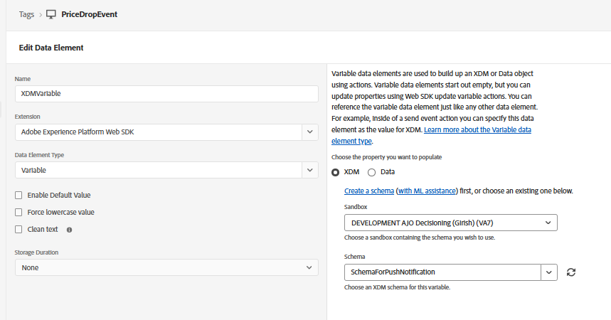

# Create Tag プロパティ

このチュートリアルの第2部では、カスタム price.drop イベントを手動で送信することで、プッシュ通知をリアルタイムでトリガーする方法について説明します。 このアプローチでは、AEP Data Collection （Tags）を使用して、web ページからイベントを取得し、Adobe Experience Platformに送信します。 イベントが取り込まれると、Adobe Journey Optimizerでジャーニーがトリガーされ、ユーザーのアクションやビジネスイベントにもとづいてプッシュ通知をオンデマンドで送信できます。

このプロパティは、チュートリアルの前に作成した`WebPushDataStream`に接続されているAEP Web SDKで設定されます。 タグプロパティは、Adobe データレイヤーの`price.drop` イベントをリッスンし、ProductListItems データ要素を更新して、関連する製品の詳細をマッピングします。 データが準備されると、タグプロパティのルールが実行され、Web SDKを介してprice.drop イベントがAEPに送信されます。 このイベントは、Adobe Journey Optimizerのジャーニーの出発点となり、値下がりにもとづいてプッシュ通知を即座に配信することができます。

## タグ要素

ProductListItems：製品の詳細を保持


`schemaForPushNotification`へのxdmvariable マッピング



## ルールを作成

price.drop イベントを聴く


更新変数を使用してproductListItemsを更新する

最後に、更新されたxdmvariableを使用してprice.drop イベントをAEPに送信します


次のJavaScript コードは、web ページからAEP タグにprice.drop イベントを送信します

```javascript
 <script>
      window.adobeDataLayer.push({
        event: "price.drop",
        productListItems: productListItems
      });
  </script>
```
