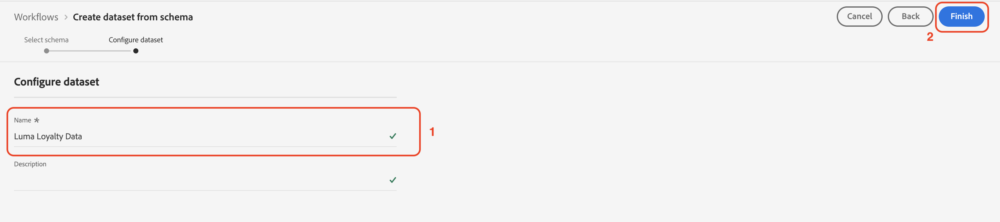

# データの手動取り込み

この節では、データセットを作成しサンプルデータを取り込むために必要な手順について説明します。

>[!TIP]
>
> ビデオチュートリアルを見る [データセットの作成とデータの取り込み](/help/set-up-data/create-datasets-and-ingest-data.md) 始める前に

5 つの [!UICONTROL データセット] Luma に基づく [!UICONTROL スキーマ] 次の場所で作成した [前のセクション](/help/tutorial-configure-a-training-sandbox/manual-data-set-up.md). データセットを作成したら、ダウンロードして変更した JSON ファイルからデータを取り込むことができます。 ( [概要と前提条件](/help/tutorial-configure-a-training-sandbox/introduction-and-prerequisites.md) を参照 )。

## 最初のデータセットの作成

という名前のデータセットを作成します。 *[!DNL Luma Loyalty Data]* から [!DNL Luma Loyalty schema]

1. 左のナビゲーションから、の下に移動します。 [!UICONTROL データ管理]を選択します。 **[!UICONTROL データセット]**.

1. 選択 **[!UICONTROL データセットを作成]**.

   

1. 次のページで、 [!UICONTROL スキーマからデータセットを作成].

   

1. 次のページで、 *[!DNL Luma Loyalty]* スキーマを作成しました。

1. *[!DNL Luma Loyalty]* を選択します。

1. 「**[!UICONTROL 次へ]**」をクリックします。

   

1. データセットの設定：

   * 名前: `Luma Loyalty Data`

1. 「**[!UICONTROL 完了]**」をクリックします。

   

## サンプルデータの取り込み

データセットを作成した後、データをデータセットに取り込むことができます。

1. の [!DNL Luma Loyalty Data] ページで、右パネルの下部を下にスクロールして、 [!UICONTROL データを追加] セクションと有効：

   * **[!UICONTROL エラー診断]** および

   * **[!UICONTROL 部分取り込み]**

   

1. 次をドラッグ&amp;ドロップ： `luma-loyalty.json` ファイルを使用して、サンプルデータをデータセットにアップロードします。

1. ページを更新し、バッチのステータスを確認して、ファイルが正しく取り込まれたことを確認します。

   375 件のレコードが取り込まれているはずです。 データが取り込まれるまでに数分かかる場合があります。

>[!TIP]
>
>バッチが失敗した場合は、 `luma-loyalty.json` を [組織 ID](https://experienceleague.adobe.com/docs/core-services/interface/administration/organizations.html?lang=ja).

## さらに 5 つ作成 [!UICONTROL データセット]

次に、次の 5 つの追加を作成します。 [!UICONTROL データセット] および `Luma CRM Data`、 `Luma Products Data`、および `Luma Test Profiles` データセット。

| データセット名 | スキーマから | 取り込むファイル | レコード |
| -----| ------ | -------| ------- |
| `Luma CRM Data` | `Luma CRM` | `luma-crm.json` | 500 |
| `Luma Products Data` | `Luma Products` | `luma-products.json` | 92 |
| `Luma Product Interactions Data` | `Luma Product Interactions` | なし | 0 |
| `Luma Product Inventory Events` | `Luma Product Inventory Events` | なし | 0 |
| `Luma Test Profiles` | `Luma Test Profiles` | `luma-test-profiles.json` | 3 |

## 次の手順

必要なすべてのデータセットが正常に作成され、サンプルデータが取り込まれました。 最後に、 [イベントの設定](/help/tutorial-configure-a-training-sandbox/configure-events.md).
