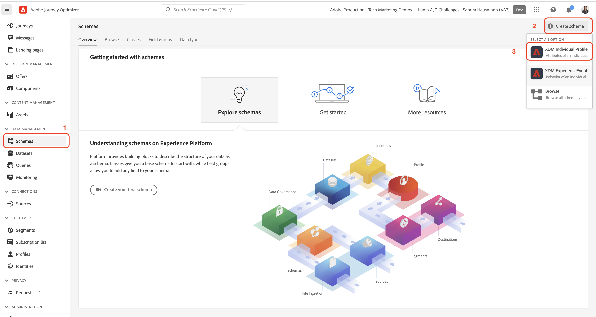
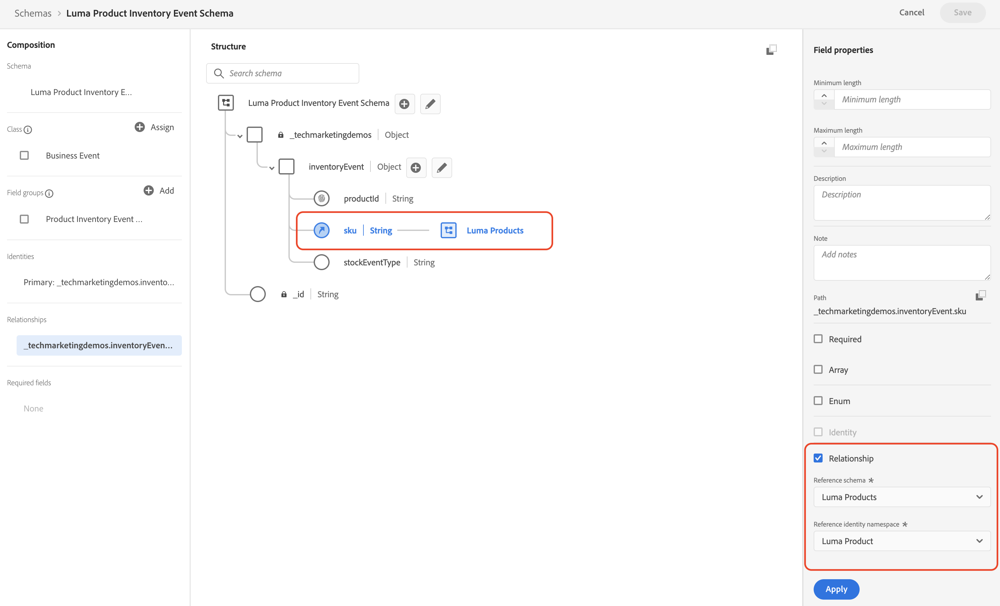

# 手動でのデータの設定

この節では、必要な ID 名前空間を作成し、 [!DNL Luma] サンプルデータ構造を作成する [[!UICONTROL スキーマ]](https://experienceleague.adobe.com/docs/experience-platform/xdm/schema/composition.html?lang=ja).

>[!TIP]
>ビデオチュートリアルを見る [ID をマッピング](/help/set-up-data/map-identities.md) 始める前に

## 手順 1:ID 名前空間の作成

この手順では、の ID 名前空間を作成します [!DNL Luma] カスタム id フィールド名 `lumaLoyaltyId`, `lumaCrmId`、および `lumaProductSKU`. ID 名前空間は、同じ名前空間内の 2 つの一致する値によって 2 つのデータソースが ID グラフを形成できるので、リアルタイム顧客プロファイルの構築に重要な役割を果たします。

最初に、 [!UICONTROL 名前空間] の [!DNL Luma Loyalty ID] schema:

1. Journey Optimizerユーザーインターフェイスで、*に移動します。**[!UICONTROL 顧客]** > **[!UICONTROL ID]** をクリックします。

1. 選択 **[!UICONTROL ID 名前空間を作成]**.

1. 次の詳細を入力します。

   | 表示名 | ID シンボル | タイプ |
   |---|---|---|
   | `Luma Loyalty ID` | `lumaLoyaltyId` | [!UICONTROL クロスデバイス ID] |

1. 「**[!UICONTROL 作成]**」を選択します。

   

1. 同じ手順で、さらに 2 つの名前空間を作成します。

   | 表示名 | ID シンボル | タイプ |
   |---|---|---|
   | `Luma CRM ID` | `lumaCrmId` | [!UICONTROL クロスデバイス ID] |
   | `Luma Product SKU` | `lumaProductSKU` | [!UICONTROL 人以外の識別子] |

## 手順 2:スキーマを作成

この手順では、6 つの [[!UICONTROL スキーマ]](https://experienceleague.adobe.com/docs/experience-platform/xdm/schema/composition.html):

* [[!DNL Luma Loyalty Schema]](#create-luma-loyalty-schema)

* [[!DNL Luma Product catalog Schema]](#create-luma-product-catalog-schema)

* [[!DNL Luma Product Inventory Events]](#create-luma-product-inventory-event-schema)

* [[!DNL Luma CRM Schema]](#create-luma-crm-and-luma-product-interactions-schemas)

* [[!DNL Luma Web Events Schema]](#create-luma-crm-and-luma-product-interactions-schemas)

* [[!DNL Luma Test Profiles Schema]](#create-luma-crm-and-luma-product-interactions-schemas)

>[!TIP]
>
>次のビデオチュートリアルをご覧ください。 [スキーマの作成](/help/set-up-data/create-schema.md) 始める前に

### 作成 [!DNL Luma Loyalty] [!UICONTROL スキーマ] {#create-luma-loyalty-schema}

#### スキーマの作成

最初に、 [!DNL Luma Loyalty] schema:

1. に移動します。 **[!UICONTROL データ管理]** > **[!UICONTROL スキーマ]** をクリックします。

1. 選択 **[!UICONTROL スキーマを作成]** 右上に

1. ドロップダウンメニューで、「 」を選択します。 **[!UICONTROL XDM 個人プロファイル]**&#x200B;個々の顧客の属性（ポイント、ステータスなど）をモデリングするので、個別の顧客の属性をモデリングする場合に使用します。

   

#### 既存のフィールドグループを追加

次に、スキーマにフィールドグループを追加するよう求められます。 グループを使用して、スキーマにすべてのフィールドを追加する必要があります。 既存のフィールドグループを追加しようとしているので、フィールドグループを作成する必要があります。

>[!NOTE]
>
>この [!UICONTROL フィールドグループ] モーダルは [!UICONTROL スキーマ] ページ、選択 **[!UICONTROL 追加]** （次の画像に示すように）

1. の **[!UICONTROL フィールドグループの追加]** ページで、次のフィールドグループを有効にします。

   * **[!UICONTROL 人口統計の詳細]** （名前や生年月日などの基本的な顧客データ）。

   * **[!UICONTROL 個人の連絡先の詳細]** ：基本的な連絡先の詳細（電子メールアドレスや電話番号など）。

   * **[!UICONTROL ロイヤルティの詳細]** ロイヤルティの詳細（ポイント、結合日、ステータスなど）。 ロイヤルティフィールドグループはリストのずっと下にあるので、検索が最も簡単です。

1. 選択 **[!UICONTROL フィールドグループを追加]** :3 つのフィールドグループをすべてスキーマに追加します。

   

1. スキーマの最上位のノードを選択します。

1. 入力 `Luma Loyalty Schema` を [!UICONTROL 表示名].

#### の作成 [!UICONTROL フィールドグループ]

スキーマ間の一貫性を確保するため、Adobeでは、1 つのグループ内のすべてのシステム識別子を管理することをお勧めします。

1. 次の **[!UICONTROL 構成]** 下のセクション [!UICONTROL フィールドグループ]を選択します。 **[!UICONTROL 追加]**.

1. 選択 **[!UICONTROL 新しいフィールドグループを作成]**.

1. 追加 `Luma Identity Profile Field Group` を **[!UICONTROL 表示名]**.

1. 追加 `system identifiers for XDM Individual Profile class` を **[!UICONTROL 説明]**.

1. 選択 **[!UICONTROL フィールドグループを追加]**.

   

#### 新しい [!UICONTROL フィールドグループ]

新しい空のフィールドグループがスキーマに追加されます。 「+」ボタンを使用すると、階層内の任意の場所に新しいフィールドを追加できます。 この場合、ルートレベルにフィールドを追加する必要があります。

1. 選択 **[!UICONTROL +]** をクリックします。

   この手順では、以下にフィールドを追加します。 **テナント id** 名前空間を使用して、カスタムフィールドと標準フィールドの競合を管理します。

1. 内 **[!UICONTROL フィールドプロパティ]** サイドバーで、新しいフィールドの詳細を追加します。

   * **フィールド名:** `systemIdentifier`

   * **[!UICONTROL 表示名]:** `System Identifier`

   * **タイプ：** オブジェクト

   * **[!UICONTROL フィールドグループを割り当て]:** [!DNL Luma identifiers]

1. 選択 **[!UICONTROL 適用]**.

   

   以下に 2 つのフィールドを追加します。 `systemIdentifier` オブジェクト：

   | [!UICONTROL フィールド名] | [!UICONTROL 表示名] | [!UICONTROL タイプ] |
   |-------------|-----------|----------|
   | `loyaltyId` | `Loyalty ID` | [!UICONTROL 文字列] |
   | `crmId` | `CRM Id` | [!UICONTROL 文字列] |

#### ID を設定

これで、 [!UICONTROL 名前空間] そして [!DNL Luma Loyalty schema] 設定済み データを取り込む前に、ID フィールドにラベルを付ける必要があります。 で使用する各スキーマ [!UICONTROL リアルタイム顧客プロファイル] はプライマリ id を指定する必要があり、取り込まれる各レコードにはそのフィールドの値が必要です。

1. を **プライマリ ID**:

   次の **[!DNL Luma Loyalty Schema]**:

   1. 「**[!DNL Luma Identity Profile Field Group]**」を選択します。

   2. を選択します。 **[!DNL loyaltyId]** フィールドに入力します。

   3. 内 **[!UICONTROL フィールドプロパティ]**、を有効にします。 **[!UICONTROL ID]** ボックス

   4. を有効にします。 **[!UICONTROL プライマリID]** ボックス

   5. を選択します。 `Luma Loyalty Id` 名前空間 **[!UICONTROL ID 名前空間]** ドロップダウン。

   6. 選択 **[!UICONTROL 適用]**.

      

2. を設定します。 **セカンダリ ID**:

   次の **[!DNL Luma Loyalty Schema]**:

   1. を選択します。 **[!DNL Luma Identity Profile Field Group]**...

   2. を選択します。 `crmId` フィールドに入力します。

   3. 内 **[!UICONTROL フィールドプロパティ]**、を有効にします。 **[!UICONTROL ID]** ボックス

   4. を選択します。 `Luma CRM Id` 名前空間 **[!UICONTROL ID 名前空間]** ドロップダウン。

   5. 選択 **[!UICONTROL 適用]**.

#### プロファイルを有効にしてスキーマを保存

1. スキーマの最上位のノードを選択します。

1. 内 [!UICONTROL フィールドプロパティ] 有効 **[!UICONTROL プロファイル]**.

   スキーマは次のようになります。

   

1. 「**[!UICONTROL 保存]**」を選択します。

### 作成 [!DNL Luma Product catalog Schema] {#create-luma-product-catalog-schema}

1. に移動します。 [!UICONTROL データ管理] -> **[!UICONTROL スキーマ]** をクリックします。

1. を選択します。 **[!UICONTROL スキーマを作成]** 」ボタンを右上にクリックします。

1. ドロップダウンメニューで、「 」を選択します。 **[!UICONTROL すべてのスキーマタイプを参照]**：クラスを作成できます。

1. 選択**[!UICONTROL 新しいクラスを作成].

1. 表示名を追加します。 `Luma Product Catalog Class`.

1. クラスを割り当てます。

1. の作成 [!UICONTROL フィールドグループ]:

   * 表示名： `Luma Product Catalog Field Group`

1. 次のフィールドを **[!DNL Luma Product Catalog Field Group]**.

   * フィールド名: `product`

   * 表示名： `Product`

   * タイプ： [!UICONTROL オブジェクト]

   * フィールドグループ: [!DNL Luma Product Catalog Field Group]

1. 選択 **[!UICONTROL 適用]**.

1. 次のフィールドを **[!DNL Product]** オブジェクト：

   | [!UICONTROL フィールド名] | [!UICONTROL 表示名] | [!UICONTROL タイプ] |
   |-------------|-----------|----------|
   | `sku` | `SKU` | [!UICONTROL 文字列] |
   | `name` | `Name` | [!UICONTROL 文字列] |
   | `category` | `Category` | [!UICONTROL 文字列] |
   | `color` | `Color` | [!UICONTROL 文字列] |
   | `size` | `Size` | [!UICONTROL 文字列] |
   | `price` | `Price` | [!UICONTROL Double] |
   | `description` | `Description` | [!UICONTROL 文字列] |
   | `ImageURL` | `Image URL` | [!UICONTROL 文字列] |
   | `stockQuantity` | `Stock Quantity` | [!UICONTROL 文字列] |

1. を **[!DNL SKU]** プライマリ ID として
2. を **[!UICONTROL 表示名]** `Luma Product Catalog Field Group` から [!UICONTROL フィールドグループ].

3. 「**[!UICONTROL 保存]**」を選択します。

### 作成 [!DNL Luma Product Inventory Event Schema] {#create-luma-product-inventory-event-schema}

1. に移動します。 **[!UICONTROL データ管理]** -> **[!UICONTROL スキーマ]** をクリックします。

1. を選択します。 **[!UICONTROL スキーマを作成]** 」ボタンを右上にクリックします。

1. ドロップダウンメニューで、「 」を選択します。 **[!UICONTROL すべてのスキーマタイプを参照]**.

1. 選択 **[!UICONTROL 新しいクラスを作成]**.

1. 表示名を追加します。 `Luma Business Event Class`.

1. タイプを選択： *[!UICONTROL 時系列]*.

1. クラスを割り当てます。

1. の作成 [!UICONTROL フィールドグループ]:

   * 表示名： `Luma Product Inventory Event Details Field Group`

1. を **[!UICONTROL 表示名]** `Luma Product Inventory Event Schema` をスキーマに追加します。

1. 次のフィールドを **[!DNL Luma Product Inventory Event Details Field Group]**:

   * フィールド名: `inventoryEvent`

   * 表示名： `Inventory Event`

   * タイプ： [!UICONTROL オブジェクト]

   * フィールドグループ： [!DNLLUma 製品在庫イベント詳細フィールドグループ]

1. 次のフィールドを **[!DNL Product Inventory Event Details]** オブジェクト：

   | [!UICONTROL フィールド名] | [!UICONTROL 表示名] | [!UICONTROL タイプ] |
   |-------------|-----------|----------|
   | `sku` | `SKU` | [!UICONTROL 文字列] |
   | `stockEventType` | `Stock Event Type` | [!UICONTROL 文字列] |

   1. 設定する `stockEventType` 列挙に型を選択します。 `string`.

   2. 下にスクロールして **[!UICONTROL フィールドプロパティ]**.

   3. 有効にする **[!UICONTROL Enum]**.

   4. 入力 **[!UICONTROL 値] ([!UICONTROL ラベル )]**: `restock` (`restock`) をクリックします。

   5. 選択 **[!UICONTROL 行を追加]**.

   6. 入力 **[!UICONTROL 値] ([!UICONTROL ラベル )]**: `outOfStock` (`out of stock`) をクリックします。

   7. 選択 **[!UICONTROL 適用]**.

      

2. 設定 `productId` ～としてのフィールド **[!UICONTROL プライマリ ID]** using **[!DNL Luma Product namespace]**.

3. を選択します。 `sku` フィールドを開き、 `product.sku` フィールド **[!DNL Luma Product catalog Schema]** スキーマ：

   1. 下にスクロールして **[!UICONTROL フィールドプロパティ]**.

   2. 有効にする **[!UICONTROL 関係]**.

      1. **[!UICONTROL 参照スキーマ]**: [!DNL Luma Product catalog Schema].

      2. **[!UICONTROL 参照 ID 名前空間]**: [!DNL Luma Product].
   3. 選択 **[!UICONTROL 適用]**.

      スキーマは次のようになります。

      

4. 有効にする対象 **プロファイル**.

5. 選択 [!UICONTROL 保存] スキーマを保存します。

### を作成します。 [!DNL Luma CRM] および [!DNL Luma Product Interactions] スキーマ {#create-luma-crm-and-luma-product-interactions-schemas}

次の追加情報を作成します。 [!UICONTROL スキーマ]:

| [!UICONTROL 表示名] | [!DNL Luma CRM] | [!DNL Luma Product Interactions] | [!DNL Luma Test Profiles] |
|  ---| ------- | ---- |----|
| **[!UICONTROL タイプ]** | [!UICONTROL XDM 個人プロファイル] | [!UICONTROL XDM エクスペリエンスイベント] | [!UICONTROL XDM 個人プロファイル] |
| **[!UICONTROL 既存のフィールドグループを追加]** | Luma 識別子 人口統計の詳細 個人の連絡先の詳細 | ID マップ コマースの詳細 | Luma 識別子 人口統計の詳細 個人の連絡先の詳細 プロファイルテストの詳細 |
| **[!UICONTROL 関係]** |  | *[!DNL productListItems.SKU]*:  参照スキーマ *[!DNL Luma Product catalog Schema]*  [!DNL Reference identity namespace] *[!DNL Luma Product]* スキーマ |
| **[!UICONTROL プライマリID] [!UICONTROL 名前空間])** | systemIdentifier.crmId (Luma CRM Id) |  | personalEmail.address (Email) |
| **[!UICONTROL セカンダリID] [!UICONTROL 名前空間]** | personalEmail.address (Email) mobilePhone.number (Phone) |  |
| **[!UICONTROL プロファイルに対して有効にする]** | ○ | ○ | ○ |

## 次の手順

これで、データ構造が作成され、 [データセットの作成とサンプルデータの取り込み](/help/tutorial-configure-a-training-sandbox/manual-data-ingestion.md).
