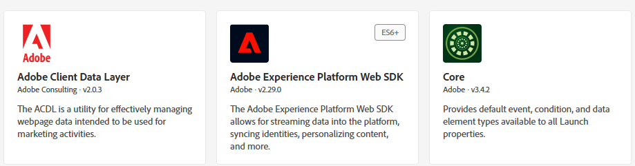
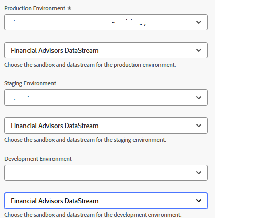
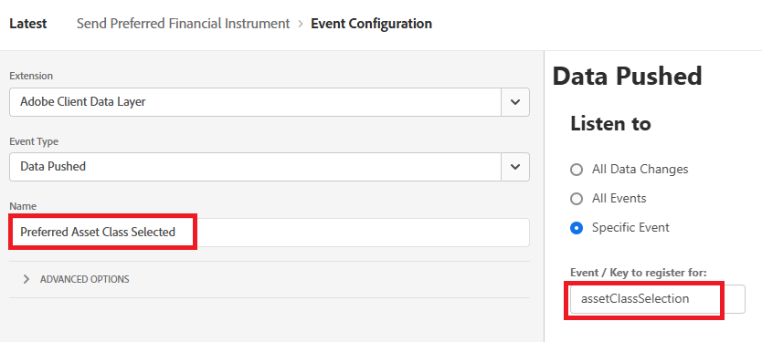
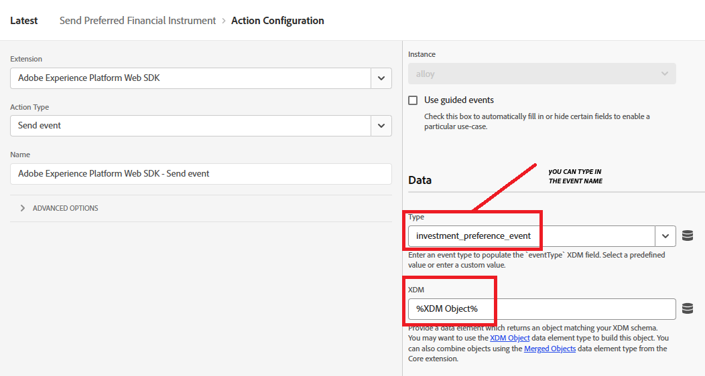
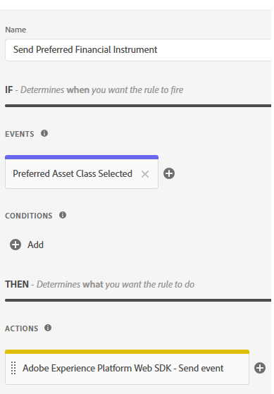
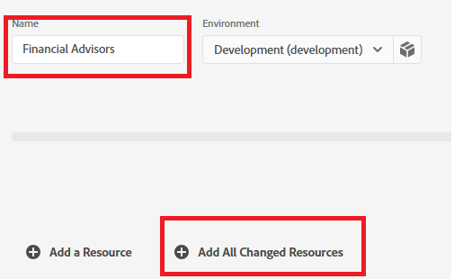

# Adobe Experience Platform タグの作成

Adobe Experience Platform Tags （旧Adobe Launch）を使用すれば、サイトのコードを変更することなく、マーケティングおよび分析テクノロジーをweb サイトに管理およびデプロイできます。

この[&#x200B; ビデオでは、Adobe Experience Tags](https://experienceleague.adobe.com/ja/playlists/experience-platform-get-started-with-tags)の作成手順について説明します

* データ収集にログイン
* タグ/新規プロパティをクリックします
* Financial AdvisorsというAdobe Experience Platformタグを作成します。

* タグに次の拡張機能を追加します
  

* 前の手順で作成した正しい環境とFinancial Advisors DataStreamを使用するように、Adobe Experience Platform Web SDKを構成してください。
  

* Adobe Client Data LayerとCore拡張機能に追加の設定は必要ありません

## データ要素の作成

データ要素は、web ベースのマーケティングと広告テクノロジーをまたいでデータを収集、整理、配信するために使用されます。

次のデータ要素を作成します

| 要素名 | 拡張機能 | データ要素タイプ | 追加コメント |
|------------------------------|-----------------------------------|-------------------|------------------------------------------------------------------------------------------------------------------------------------------------------------------|
| PreferredFinancialInstrument | コア | カスタムコード | 以下のメモを参照してください |
| XDM オブジェクト | Adobe Experience Platform Web SDK | XDM オブジェクト | 環境とFinancial Advisors スキーマの選択 |


カスタムコードの場合は、コードエディターを開き、次のコードをコピー&amp;ペーストします

```javascript
return window.adobeDataLayer
  ?.slice()
  .reverse()
  .find(event => event.event === "assetClassSelection")
  ?.xdm?.FinancialInterest?.PreferredFinancialInstrument || "undefined";
```

## コード説明

adobeDataLayer配列（web ページで発生するイベントを保存する）を確認します。

元の配列が変更されないように、.slice （）を使用して配列のコピーを作成します。

イベントの順序を逆にして、最初に最新のイベントを確認します。

event.eventが正確に「assetClassSelection」である最初のイベント（最新のイベントから開始）を検索します。

見つかった場合は、そのイベントのxdm データにアクセスし、FinancialInterest.PreferredFinancialInstrumentから値を取得します。

何も見つからない場合は、「undefined」という文字列を返します。


## ルールを作成

Adobe Experience Platformのルールビルダーでは、利用者の行動やイベントにもとづいて、web サイト上で特定のアクションをいつ、どのように実行すべきかを定義できます。

* 「Send Preferred Financial Instrument」という名前のルールを作成します。 このルールには、イベントとアクションが含まれています


* 次に示すように、Preferred Asset Class Selectedという名前のイベント設定を作成します。 このイベントは、assetClassSelection イベントをリッスンします。




* 更新されたXDM スキーマをAEPに送信するアクションを作成する



* 最終的なルールは次のようになります



## AEP タグのビルドとデプロイ


以下のスクリーンショットに示すように、新しいライブラリを作成し、変更されたすべてのリソースをそれに追加します。

ライブラリを追加


ライブラリの作成

ライブラリの作成画面で、ライブラリ名と環境を指定します。
変更したすべてのリソースをこのライブラリに追加する必要があります


次に、「保存して開発用にビルド」ボタンをクリックして、ライブラリをビルドします

## HTML ページにAEP タグを含める

AEP Tags プロパティを公開すると、AdobeはHTML ` <head>`内または`<body>` タグの下部に配置する必要があるスクリプトタグを提供します。

* Tags （Financial Advisors）プロパティに移動します。

* 「環境」をクリックし、必要な環境（開発、ステージング、実稼動など）のインストールアイコンをクリックします。

* 埋め込まれたコードをメモします。 このチュートリアルの後半の段階で必要になります。
