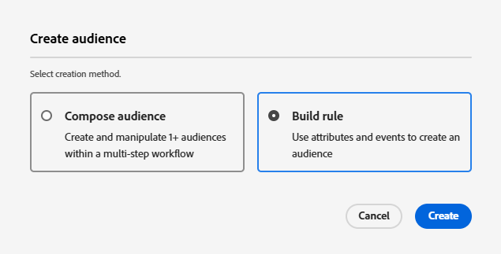
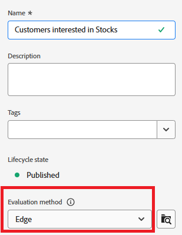

# Adobe Journey Optimizerでのオーディエンスの作成

Adobe Experience Platformの「オーディエンス」とは、パーソナライズされたエクスペリエンスを提供するために、ユーザーの行動、好み、プロファイル情報にもとづいて作成されたユーザーグループのことです。

* Journey Optimizerにログインします
* 顧客/ オーディエンス / オーディエンスの作成に移動します
* ルールを作成メソッドを使用したオーディエンスの作成

  

* 次の3つのオーディエンスを作成します

  * ストックに興味のある顧客

  * 債券に興味のある顧客

  * CDに興味のあるユーザー

* リアルタイムの選定のために、各オーディエンスの評価方法が&#x200B;_&#x200B;**Edge**&#x200B;_に設定されていることを確認します。
  

* 「PreferredFinancialInstrument」フィールドを使用して、選択した投資関心（株、債券、CDなど）に基づいてユーザーをセグメント化します

>[!NOTE]
>
>&#x200B;>「イベント」タブにPreferredFinancialInstrument フィールドが表示されない場合は、設定アイコンをクリックし、「完全なXDM スキーマを表示」を切り替えます。

