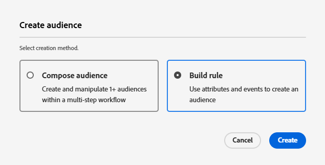

# Adobe Journey Optimizerでのオーディエンスの作成

Adobe Experience Platformのオーディエンスは、パーソナライズされたエクスペリエンスを提供するために、アクション、環境設定またはプロファイル情報に基づいて作成されたユーザーグループです。

* Journey Optimizerにログインします
* 顧客/ オーディエンス / オーディエンスを作成に移動します。
* ルールの作成方法を使用したオーディエンスの作成

  

* 次の 3 つのオーディエンスを作成します

   * 株式に関心のあるお客様

   * 社債に関心のあるお客様

   * CD に関心のあるお客様

* リアルタイムで選定するには、各オーディエンスの評価方法が **_0&rbrace;Edge&rbrace; に設定されていることを確認します。_**
  

* PreferredFinancialInstrument フィールドを使用して、選択した投資関心（株式、債券、CD など）に基づいてユーザーをセグメント化します

>[!NOTE]
>
>&#x200B;>「イベント」タブに「PreferredFinancialInstrument」フィールドが表示されない場合は、設定アイコンをクリックし、「完全な XDM スキーマを表示」を切り替えます。

