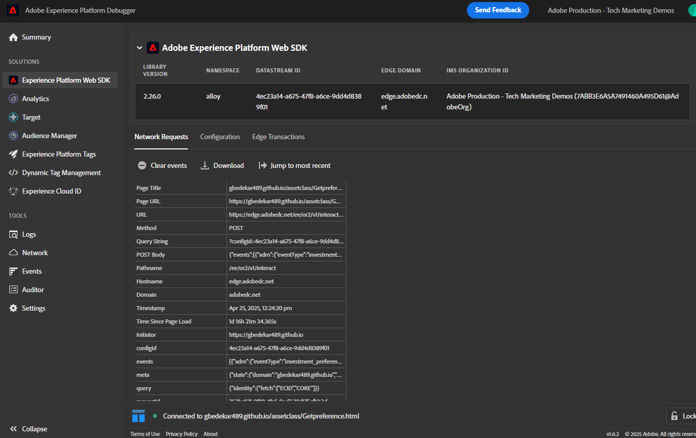
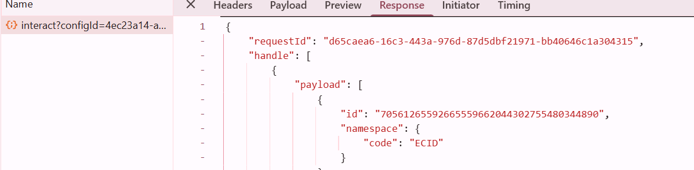
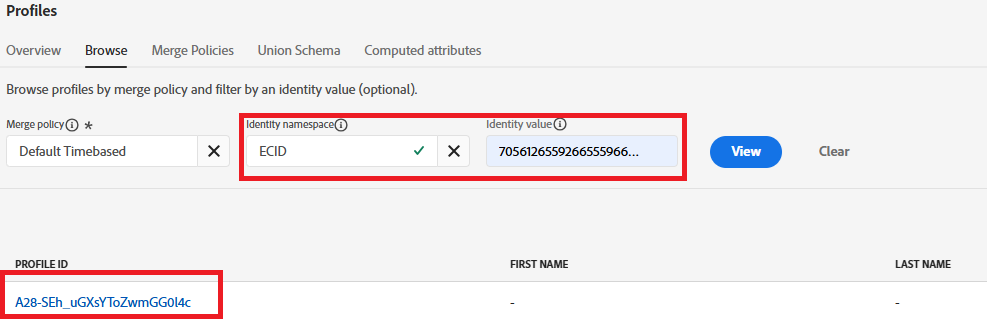
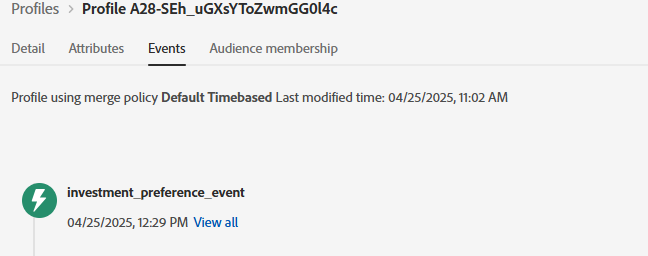

# 解決策のテスト

実装を検証するには、まず、環境設定フォームを含むweb ページを開きます。 ブラウザーの開発ツール（コンソールおよびネットワークタブ）を使用して、フォーム送信プロセスを監視します。 環境設定を送信した後（例えば、「ストック」を選択）、AEP Web SDK（alloy.sendEvent）が正常にトリガーされ、正しいデータがAdobe Experience Platformに送信されていることを確認します。 AEPで、「オーディエンス」セクションに移動し、Edge セグメンテーションを使用して、数秒以内にプロファイルが想定されるオーディエンスに適格であることを確認します（「株に興味がある」など）。 また、関連するデータセット内の受信イベントデータを調べて、正しい環境設定値が含まれていることを確認することもできます。 このプロセスを各アセットクラス（株式、債券、CD）に対して繰り返し、完全なワークフローが正しく機能していることを確認します。

## トラブルシューティングのヒント

目的のオーディエンスに対してプロファイルの適格性がすぐに表示されない場合は、次の点を確認します。

### Adobe データレイヤープッシュの検証

* ブラウザーのDeveloper Tools → Consoleを開きます
* console.log （window.adobeDataLayer）と入力します。
* イベント「assetClassSelection」と正しいPreferredFinancialInstrument値を持つイベントがフォーム送信後に表示されることを確認します

### 起動ルールの実行を確認

* Adobe Experience Platform Debugger（Chrome拡張機能）を開く
* デバッガーにログイン
* フォームを送信
* assetClassSelectionのDataPushed イベントがキャプチャされていることを確認します

次のデバッガーのスクリーンショットが役立ちます

### ECIDを取得

ECID （Experience Cloud ID）は、Adobe Experience Cloudのソリューションとセッションをまたいでユーザーを認識し、統合するために使用される、Adobeの一意の永続的なIDです。

* 「Chrome Developer Tools → Network」タブ

* 「インタラクション」または「収集」でフィルタリング

* フォームを送信
* 「応答」タブをクリックし、ECIDをメモします

### リアルタイムのプロファイルとオーディエンスの選定

* Journey Optimizerにログインします
* 顧客/プロファイル/参照に移動
* スクリーンショットに示すように、前の手順で取得したECIDを検索します
  
* プロファイルをクリックし、「イベント」タブを選択して、investment_preference_eventがリストされているかどうかを確認します
  
* イベントに関連付けられているjsonを開き、正しいイベントデータが含まれているかどうかを確認します。

### その他のトラブルシューティングのヒント

* スキーマとデータセットプロファイルが有効になっていることを確認します。
* Edgeのセグメント化がオーディエンスに対して有効になっていることを確認し、ほぼリアルタイムで選定を行います。
* 数分待ってオーディエンスビューを更新すると、特に公開後にテストを行う場合に役立ちます。
* オーディエンスルールが正しく定義されていることを確認し、フォーム送信から取得したフィールド名と値を正確に参照してください。
