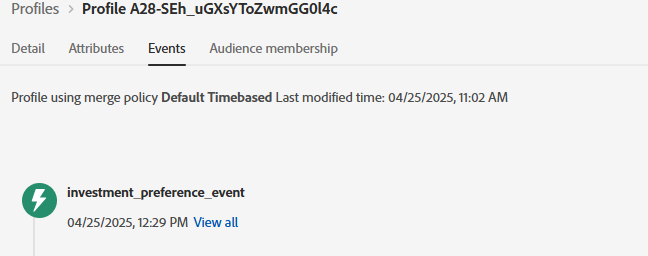

# ソリューションのテスト

実装を検証するには、まず環境設定フォームを含む web ページを開きます。 ブラウザーの開発ツール（「コンソール」タブと「ネットワーク」タブ）を使用して、フォーム送信プロセスを監視します。 環境設定を送信した後（例えば「在庫」を選択した後）、AEP Web SDK（alloy.sendEvent）が正常にトリガーされ、正しいデータがAdobe Experience Platformに送信されることを確認します。 AEPで、「オーディエンス」セクションに移動し、Edge セグメント化を使用してプロファイルが数分以内に期待されるオーディエンス（「Interested in Stock」など）に該当することを確認します。 また、関連するデータセットで受信イベントデータを調べて、正しい設定値が含まれていることを確認することもできます。 完全なワークフローが正しく機能していることを確認するために、アセットクラス（Stock、Bonds、CD）ごとにこのプロセスを繰り返します。

## トラブルシューティングのヒント

プロファイルが対象オーディエンスに適合することが直ちに表示されない場合は、次の点を確認してください。

### Adobe データレイヤーのプッシュを検証

* ブラウザーの開発者ツール → コンソールを開きます。
* console.log （window.adobeDataLayer）と入力します。
* イベント「assetClassSelection」を含むイベントと正しい PreferredFinancialInstrument 値がフォーム送信後に表示されることを確認します

### ローンチルールの実行の確認

* Adobe Experience Platform Debugger（Chrome Extension）を開きます
* デバッガーへのログイン
* フォームを送信
* assetClassSelection の DataPushed イベントがキャプチャされていることを確認します

次のデバッガーのスクリーンショットは、ヘルプとなります

### ECID の取得

ECID （Experience Cloud ID）は、Adobeのソリューションおよびセッションをまたいでユーザーを認識および統合するために使用される、Experience Cloudの一意で永続的な識別子です。

* Chrome開発者ツール→「ネットワーク」タブ

* 「interact」または「collect」でフィルタリングします

* フォームを送信
* 「応答」タブをクリックし、ECID をメモします

### リアルタイムプロファイルとオーディエンスの選定を確認

* Journey Optimizerにログインします
* 顧客/プロファイル/参照に移動します。
* スクリーンショットに示すように、前のステップで取得した ECID を検索します。
  
* プロファイルをクリックし、「イベント」タブを選択して、investment_preference_event がリストされているかどうかを確認します
  
* イベントに関連付けられた json を開き、正しいイベントデータが含まれているかどうかを確認します。

### その他のトラブルシューティングのヒント

* スキーマとデータセットプロファイルが有効になっていることを確認します。
* ほぼリアルタイムで選定が行われるように、オーディエンスに対してEdgeのセグメント化が有効になっていることを確認します。
* 数分待ってからオーディエンス ビューを更新すると、特に、変更を公開した直後にテストする場合に役立ちます。
* オーディエンスルールが正しく定義され、フォーム送信から取り込まれた正確なフィールド名と値を参照していることを確認します。

