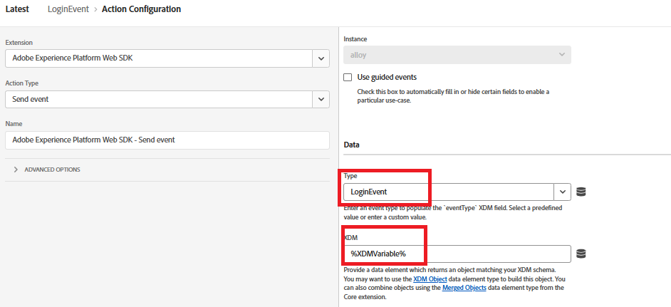

# Adobe Experience Platformへの CRMID の送信

Adobe Experience Platform タグは、ブラウザーから直接 ID データを送信するための柔軟なイベント駆動型のメカニズムを提供するので、CRMID をAdobe Experience Platform（AEP）に送信するために使用されます。 ユーザーログイン後に CRMID を送信すると、AEPで匿名 ECID を既知の CRM プロファイルにリンクできるので、正確な ID のステッチが可能になります。 この連携は、統合された顧客プロファイルを作成し、オーディエンスを絞り込み、パーソナライズされたエクスペリエンスをAdobe Journey Optimizer（AJO）でリアルタイムに提供するための基盤となります。

_**FinWise**_ というExperience Platform タグプロパティが作成されます。 タグプロパティに追加された拡張機能は次のとおりです

前の手順で作成した Financial Advisors DataStream を使用して、AEP Web SDK拡張機能を設定します。
Experience Cloud ID サービスは、デバッグ目的でタグプロパティに追加されるオプションの拡張機能です。

## タグデータ要素

次のデータ要素を作成します

| データ要素 | 拡張機能 | データ要素タイプ | カスタム設定 |
|--------------|-----------------------------------|---------------------------|----------------------------------------|
| crmid | Adobe Client Data Layer | データレイヤーの計算済み状態 | user.crmid |
| ECID | Experience Cloud ID サービス | ECID |                                        |
| ID | Adobe Experience Platform Web SDK | ID マップ |  |
| XDMVariable | Adobe Experience Platform Web SDK | Variable |  |

## ルールを作成

次のイベントとアクションを持つ LoginEvent というルールを作成します

イベント

変数を更新アクション

イベント送信アクション

## 保存してビルド

変更を保存し、ライブラリを作成およびビルドします。
