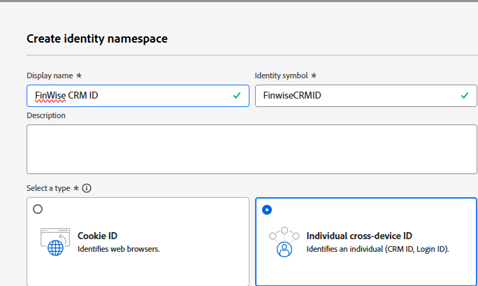
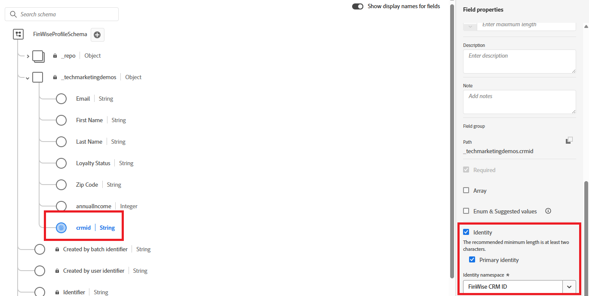
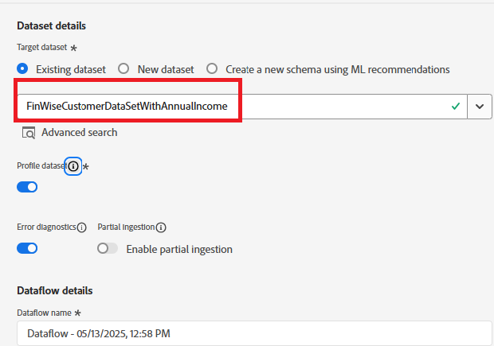
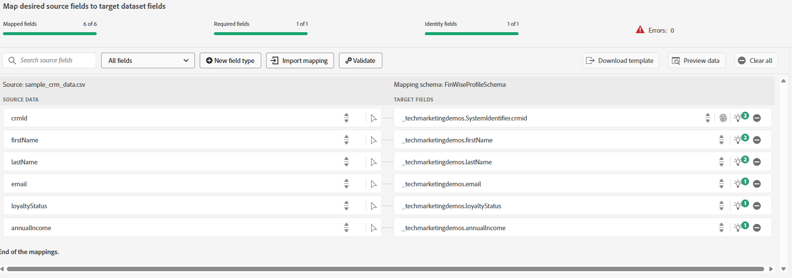
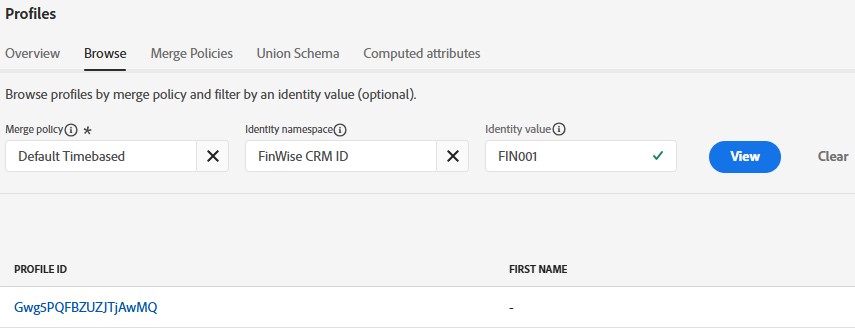

# サンプル CRM データをAEP プロファイルデータセットにインポートする

IDの合成を開始するには、サンプル CRM プロファイルデータを、Adobe Experience Platformのプロファイル対応スキーマに関連付けられたデータセットに読み込みます

## カスタム名前空間の作成

* 顧客/ID/IDの作成に移動します。
* 下のスクリーンショットに示すように、「個々のクロスデバイス ID」を選択し、表示名とID記号を指定します。
  

## プロファイル対応スキーマの作成

**_FinWiseProfileSchema_**という名前の個々のプロファイルスキーマを作成します。 annualIncome、email、firstName、lastName、loyaltyStatusなどのフィールドを含めます。
図のように、ID フィールド **_crmid_**&#x200B;を追加します。 crmid フィールドをIDおよびプライマリとしてマークします。

## サンプルデータの準備

ダミーのメールアドレスを実際のメールアドレスに更新します。 これらは、後でAdobe Journey Optimizerでメッセージを送信する際に使用されます。

|   | crmId | firstName | lastName | メール | loyaltyStatus | zipCode | 年収 |
|---|--------|-----------|----------|-------------------------|---------------|---------|--------------|
|   | FIN001 | アリス | ウォン | alice.wong@example.com | ゴールド | 92128 | 120000 |
|   | FIN002 | Bob | スミス | bob.smith@example.com | シルバー | 92126 | 85000 |
|   | FIN003 | Charlie | Kim | charlie.kim@example.com | プラチナ | 60614 | 175000 |
|   | FIN004 | ダイアナ | リー | diana.lee@example.com | ゴールド | 30303 | 98000 |
|   | FIN005 | イーサン | ブラウン | ethan.brown@example.com | ブロンズ | 75201 | 60000 |

## CSV ファイルの取り込み

* 前の手順で作成した&#x200B;**_FinWiseProfileSchema_**&#x200B;に基づいて、**_FinWiseCustomerDataSetWithAnnualIncome_**&#x200B;というデータセットを作成します。データセットがプロファイルに対して有効になっていることを確認してください。

* 接続/ソース/ローカルシステムに移動します
* ローカルファイルのアップロードで「**_データを追加_**」を選択します。 ターゲットデータセットとして&#x200B;_**FinWiseCustomerDataSetWithAnnualIncome**_を選択してください。
  
* 次の画面に移動します。 [csv ファイル ](assets/finwise_profiles.csv)をアップロードし、マッピングを確認します
  

* 「完了」をクリックして、データ取り込みプロセスを開始します

## プロファイルを確認

* 顧客/プロファイルに移動し、FinWise CRM IDがFIN001または他の有効な値と等しいかどうかを検索します
  
