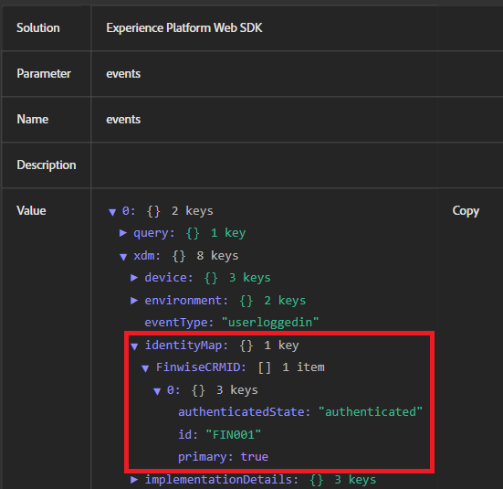

# ID接続のテスト

このサンプルアプリケーションは、CRM IDがAdobe Experience Platform（AEP）に送信される前に、サーバーサイドでユーザーの資格情報が検証される実際のログインフローをシミュレートします。 ローカルのNode.js サーバーを使用すると、web ページを安全に配信し、基本的な認証ロジックを処理し、Adobe LaunchまたはWeb SDKの機能を妨げる可能性があるブラウザーの制限（ローカルファイルアクセスのブロックやCORS ヘッダーの欠落など）を回避できます。 この設定により、エクスペリエンスが実際の本番環境に近づきます。

## node.jsのインストール

Node.jsがインストールされていない場合は、ここからダウンロードして[ インストールします](https://nodejs.org/)

次のコマンドを実行してインストールを確認します。

`node -v`

`npm -v`

## プロジェクトフォルダーの設定

次のコマンドを使用して、サンプルアプリの新しいディレクトリを作成します

`mkdir aep-demo`

`cd aep-demo`

## プロジェクトの初期化

`npm init -y`

## Express （Web サーバーフレームワーク）のインストール

`npm install express`

## server.js ファイルの作成

```javascript
const express = require('express');
const path = require('path');
const app = express();
const PORT = 3000;

// Serve static files from the current directory
app.use(express.static(__dirname));

app.listen(PORT, () => {
  console.log(`Server is running at http://localhost:${PORT}`);
});
```

## HTML/Assetsを追加

指定したすべての[HTMLおよびCSS ファイル ](assets/login-app-files.zip)をこのフォルダーにコピーします。 AEP Tags スクリプトをコピーして、index.html ファイルの`<head>` セクション内に貼り付けます。

## サーバーの実行

`node server.js`

## テスト

`http://localhost:3000` URLを開きます。 alice/pass123を使用してログインします

## AEP Debuggerの使用

Adobe Experience Platform Debuggerは、web サイトからAdobe Experience Platformに送信されるデータの検証に役立つ強力なブラウザー拡張機能です。 特に、IDMapが正しく設定され、Adobe Web SDK（alloy.js）を介して送信されているかどうかを確認するのに便利です。

ログインイベントのテスト、ID ステッチの検証（ECIDやCRMIDの渡しなど）、AEP Tags ルールおよびData Elementsが期待どおりに実行されていることを確認する場合は、AEP Debuggerを使用します。 送信イベント、ID情報、XDM ペイロードをリアルタイムで可視化し、プロファイルのエンリッチメントとオーディエンスの選定をトラブルシューティングするために不可欠です。

次のスクリーンショットは、ID 「FIN001」が正しく渡されていることを示しています。


## AEPでID ステッチングを検証する手順

* AEPへのログイン
* 顧客/プロファイル/参照に移動します。
* FinWise CRM ID = FIN001を検索
* プロファイルを開き、「ID」セクションを確認します。 CRMIDとECIDの両方が表示されます。   これにより、ふたつのIDが単一のプロファイルにつなぎ合わされていることを確認できます。


