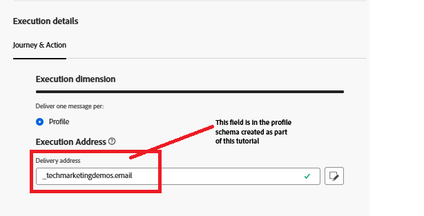
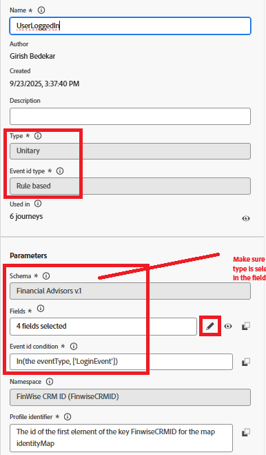
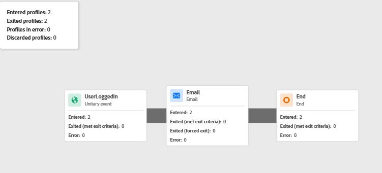

# Adobe Web SDKを使用したAdobe Journey Optimizer ジャーニーのトリガー

このID接続チュートリアルの拡張機能では、Adobe Journey Optimizer ジャーニーがトリガーされ、ログインしたユーザーにステッチされたプロファイルを使用して電子メールを送信します。 **この記事では、電子メール チャネルと、電子メール チャネル用のコンテンツの作成に精通していることを前提としています。**

## 電子メールチャネル設定の作成

* _&#x200B;**Journey Optimizer**&#x200B;_&#x200B;にログイン
* _&#x200B;**管理/ チャネル / チャネル設定の作成**&#x200B;_&#x200B;に移動します
* チャネルリストから「**電子メール**」を選択します。 意味のある名前と説明を入力します。
* メール設定を入力します。
* 以下に示すように、実行の詳細を指定します。 メールは、フィールドに保存されているプロファイルのメールアドレスに送信されます
* 
* メールチャネル設定を有効にする

## イベントを作成

* _&#x200B;**Journey Optimizer**&#x200B;_&#x200B;にログイン
* _&#x200B;**管理 – >設定**&#x200B;_&#x200B;に移動します
* イベントカードの「管理」ボタンをクリックし、「イベントを作成」をクリックします。 以下に示すように、値を指定します
* 

* イベントのeventTypeがLoginEventに等しいかどうかを確認します。 `LoginEvent` タイプはAdobe Experience Platform タグで設定されています。
* イベントを保存

## ジャーニーを作成

* _&#x200B;**Journey Optimizer**&#x200B;_&#x200B;にログイン
* _&#x200B;**ジャーニー管理/ジャーニー/ジャーニーを作成**&#x200B;_&#x200B;に移動します
* _&#x200B;**UserLoggedIn**&#x200B;_ イベントをキャンバスにドラッグ&amp;ドロップします
* アクションメニューからメールをドラッグ&amp;ドロップします。 先ほど作成したメールチャネル設定を使用するように、メールアクションを設定します。
* ジャーニーを公開します。

## ジャーニーのトリガー方法

ジャーニーは、Web SDKを介して送信されたイベントペイロードが、ジャーニーで設定されているものと一致したときにトリガーされます。 この例では、イベントは`UserLoggedIn`です。イベントタイプは`LoginEvent`です。

* ジャーニーレポートを表示して確認します
* 
