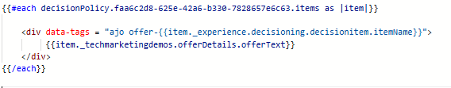

# キャンペーンの作成

web ページの利用者にパーソナライズされたオファーを配信するために、Adobe Journey Optimizerでキャンペーンを作成し、適切なチャネルであるweb チャネルを設定しました。 この設定により、web サイトを利用している利用者に対して、リアルタイムの意思決定にもとづいてオファーが配信されます。

このキャンペーンでは、オファーの選択方法を制御するための決定ポリシーが定義されました。 決定ポリシーには、次の要素で構成される選択戦略が含まれます。

オファー項目のコレクション（例えば、郵便番号や収入にもとづいて）,

どのオファーがユーザーに適用されるかを決定する適格性ルール

適格なオファーにスコアを割り当て、最も関連性の高いオファーを優先するランキング式。

ログインユーザーがサイトにアクセスすると、パーソナライゼーションリクエストがAJOに送信されます。 この決定ポリシーでは、利用者のステッチされたIDとプロファイル属性（郵便番号や年間収入など）にもとづいて、利用可能なすべてのオファーが評価されます。 選択戦略とランキングロジックを適用して、最適なマッチングを決定します。

その結果、カスタマイズされたオファーのセットがHTMLのコンテンツとして返され、web サイトのカルーセルに表示されます。これにより、シームレスでリアルタイムにパーソナライズされた体験を実現できます。

## AJOでキャンペーンを作成する手順

1. **チャネル設定の作成**\
   オファーの表示場所と表示方法（コードベースのエクスペリエンスを含むweb ページなど）を定義します。
   - ジャーニーオプトマイザーにログイン
_&#x200B;**管理 – > チャネル – > チャネル設定の作成**&#x200B;_&#x200B;に移動します
   - **名前**: `finwise-web-personalization`\
     FinWiseのパーソナライズされたweb オファー配信用にこの設定を識別します。

   - **エクスペリエンスタイプ**: `Code-based experience`\
     オファーはDOMに直接挿入されません。 代わりに、AJOは、カスタム JavaScriptを使用して解析された生のHTMLを返します。

   - **Platform**: `Web`\
     web ブラウザー向けに設計されています。 モバイルチャネルが有効になっていません。

   - **ページ URL**: `http://localhost:3000/formula.html`\
     チャネルは、開発中に使用される特定のテストページ用に設定されます。

   - **ページ上の場所**: `offers-div`\
     返されたオファーは動的に解析され、フロントエンドロジックを使用してこのコンテナにレンダリングされます。

   - **コンテンツ形式**: `HTML`\
     オファーは生のHTMLフラグメントとして配信され、スタイル設定、フィルタリング、表示の方法を完全に制御できます。

2. **新しいキャンペーンを開始**\
   「キャンペーン」セクションに移動し、新しいスケジュール済みマーケティングキャンペーンを作成します。 キャンペーンに適切な名前を付けます。

3. **アクションを追加**\
   「_&#x200B;**アクション**&#x200B;_」タブに移動します
コードベースのエクスペリエンスアクションを追加し、アクションを以前に作成したチャネル設定にリンクします。

4. **オーディエンス**\
   「_&#x200B;**オーディエンス**&#x200B;_」タブに移動します
すべての訪問者（デフォルト）。

   ID タイプ：ECID （Experience Cloud ID）
この設定では、ユーザーを認識するためのプライマリ IDとしてECIDを使用します。 IDのステッチが有効になっている場合、ECIDはPersonalized Targeting SelectのCRM IDにリンクされるか、オファーロジックを定義する決定ポリシーを作成します。

5. **決定ポリシー**

   このアクションは、オファーの選択方法と表示用に返されるオファーの数を定義する&#x200B;**決定ポリシー**&#x200B;にリンクされています。 このポリシーでは、チュートリアルの前の段階で作成された&#x200B;**選択戦略**&#x200B;を使用します。

   決定ポリシーを挿入するには、「_&#x200B;**アクション**&#x200B;_」タブの「**_コンテンツを編集_**」をクリックし、「**_コードを編集_**」をクリックしてパーソナライゼーションエディターを開きます。

   左側の&#x200B;_&#x200B;**決定ポリシー**&#x200B;_ アイコンを選択し、**決定ポリシーを追加** ボタンをクリックして、**決定ポリシーを作成**&#x200B;画面を開きます。 決定ポリシーに意味のある名前を指定し、決定ポリシーが返す項目の数を選択します。 初期設定は 1 です。**_next_**&#x200B;をクリックし、前の手順で作成した選択戦略を決定ポリシーに追加し、**next**&#x200B;をクリックして決定ポリシーの作成プロセスを完了します。 適切なフォールバックオファーを選択してください。

6. **決定ポリシーの挿入**

   新しく作成した決定ポリシーを挿入するには、「_&#x200B;**ポリシーを挿入**&#x200B;_」ボタンをクリックします。 これにより、右側のパーソナライゼーションエディターにfor ループが挿入されます。2行目の各ループの間にカーソルを置き、`tenant name`をドリルダウンしてオファーに移動してofferTextを挿入します

   パーソナライゼーションエディターに挿入された決定ポリシー

   

   Handlebars コードは、Adobe Journey Optimizerで特定の決定ポリシーによって返されたオファーをループし、各オファーに`
`を作成します。 各`
`は、オファーの内部名を持つdata-tags属性を使用して、カルーセルをグループ化し、スムーズなナビゲーションのためにカテゴリ別にオファーを整理します。 各`
`内のコンテンツには、パーソナライズされたオファーテキストが表示され、複数のオファーを動的かつ視覚的にセグメント化して表示できます。

7. **キャンペーンを保存**

   「_&#x200B;**アクティブ化のレビュー**&#x200B;_」ボタンをクリックしてキャンペーンを保存します

