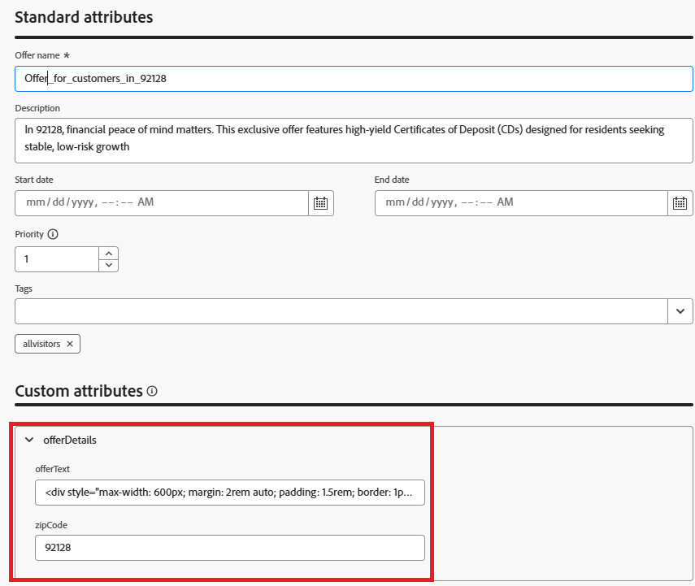

# 郵便番号のターゲティングによる位置情報を利用したオファーの作成

オファーを作成する前に、オファー項目スキーマが拡張され、新しいフィールドが含まれるようになりました。 このカスタムフィールドを使用すると、各オファーにターゲットの郵便番号を明示的にタグ付けし、決定時にロケーションベースのフィルタリングとランキングを使用できます。

スキーマを更新すると、次の2つのパーソナライズされたオファーが作成されました。

* オファー1:「ミラメサ（92126）の柔軟な投資プラン」
92126の若い専門家やテクノロジーに重点を置いた住民向けにカスタマイズされたこのオファーは、ETFや長期成長を目的としたミューチュアルファンドなどの柔軟な投資オプションを促進します。 「zipcode」フィールドは92126に設定されます。

* オファー2: &quot;Rancho Bernardo （92128）向けの高収率CD&quot;
92128ーロッパの金融的に安定した退職に適した個人をターゲットにしたこのオファーは、返品が保証された高利回りの預金証明書（CD）を特徴としています。 「zipcode」フィールドは92128に設定されます。

これらのオファーは現在、位置情報メタデータで強化されているため、後の手順でユーザープロファイルの郵便番号に基づいて動的に選択およびランキングを実行できます。

次のスクリーンショットは、オファー項目スキーマに追加されたカスタム属性を示しています。




## 92126用オファー

郵便番号のオファー92126 オファーテキスト

```html
<div style="max-width: 600px; margin: 2rem auto; padding: 1.5rem; border: 1px solid #ddd; border-radius: 12px; font-family: Arial, sans-serif; background-color: #f9f9f9; box-shadow: 0 4px 12px rgba(0,0,0,0.05);">   <h2 style="color: #1a237e; font-size: 1.5rem; margin-bottom: 0.5rem;">     Boost Your Financial Game with Smart Investment Options   </h2>   <p style="color: #333; font-size: 1rem; line-height: 1.6;">     In Mira Mesa (92126), ambition meets opportunity. Whether you're building wealth or just getting started, our     <strong>diversified investment plans</strong> — including <strong>tech-focused ETFs</strong> and     <strong>flexible mutual funds</strong> — are designed to grow with your goals.   </p>   <p style="color: #333; font-size: 1rem; line-height: 1.6;">     Enjoy expert guidance, low fees, and strategies built for busy professionals who want more from their money — without the hassle.   </p>   <a href="#start-investing" style="display: inline-block; margin-top: 1rem; background-color: #1a73e8; color: white; padding: 0.75rem 1.25rem; border-radius: 8px; text-decoration: none; font-weight: bold;">     Start Investing Smarter   </a> </div>
```


## 92128用オファー

郵便番号のオファー92128 オファーテキスト

```html
<div style="max-width: 600px; margin: 2rem auto; padding: 1.5rem; border: 1px solid #ddd; border-radius: 12px; font-family: Arial, sans-serif; background-color: #fdfdfd; box-shadow: 0 4px 12px rgba(0,0,0,0.05);">   <h2 style="color: #1a237e; font-size: 1.5rem; margin-bottom: 0.5rem;">     Grow Your Savings with Confidence – Exclusive CD Rates for 92128   </h2>   <p style="color: #333; font-size: 1rem; line-height: 1.6;">     Live in Rancho Bernardo? Take advantage of your financial momentum with our <strong>high-yield Certificates of Deposit</strong>, offering up to <strong>5.25% APY</strong>.     Designed for peace of mind and smart growth, our flexible CD options let you lock in guaranteed returns while enjoying the stability you deserve.   </p>   <p style="color: #333; font-size: 1rem; line-height: 1.6;">     Whether you're planning retirement or simply securing your future, this offer is tailored for residents like you.   </p>   <a href="#explore-cd-options" style="display: inline-block; margin-top: 1rem; background-color: #1a73e8; color: white; padding: 0.75rem 1.25rem; border-radius: 8px; text-decoration: none; font-weight: bold;">     Explore CD Options   </a> </div>
```

## 汎用オファー（フォールバックオファー）

オファーに関連付けられている郵便番号のない、汎用オファーのオファーテキスト

```html
<div style="max-width: 600px; margin: 2rem auto; padding: 1.5rem; border: 1px solid #ddd; border-radius: 12px; font-family: Arial, sans-serif; background-color: #ffffff; box-shadow: 0 4px 12px rgba(0,0,0,0.05);">
  <h2 style="color: #1a237e; font-size: 1.5rem; margin-bottom: 0.5rem;">
    Invest Smarter: Build Wealth with Flexible Financial Plans
  </h2>
  <p style="color: #333; font-size: 1rem; line-height: 1.6;">
    Looking to take control of your financial future? Our flexible investment solutions are designed to meet a wide range of goals — from growing savings to planning for retirement.
    Choose from diversified mutual funds, ETFs, and professionally managed portfolios, all with expert guidance and minimal hassle.
  </p>
  <p style="color: #333; font-size: 1rem; line-height: 1.6;">
    Whether just starting out or optimizing an existing strategy, this offer provides the tools to invest with confidence — no matter where you live.
  </p>
  <a href="#explore-investment-plans" style="display: inline-block; margin-top: 1rem; background-color: #1a73e8; color: white; padding: 0.75rem 1.25rem; border-radius: 8px; text-decoration: none; font-weight: bold;">
    Explore Investment Plans
  </a>
</div>
```

これらのオファーを&#x200B;**所得関連オファー**&#x200B;というコレクションにグループ化します

オファーはあらゆる訪問者が利用できます。つまり、厳格な適格性の制約はありません。そのため、ランキング式は、プロファイルコンテキストにもとづいて表示するオファーを決定するために重要になります。
適格性ルールではオファーがフィルタリングされないため、3つはすべて候補として扱われます。
選択戦略は、3つすべてを取得します。
ランキング式では、プロファイル属性（郵便番号や年収など）にもとづいてスコアリングし、最適なものを選択します。
