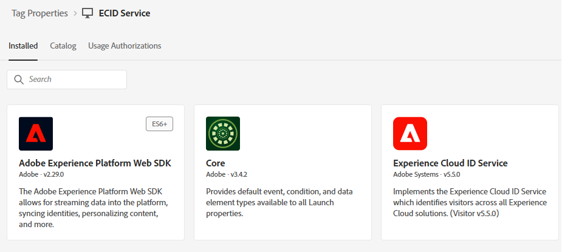
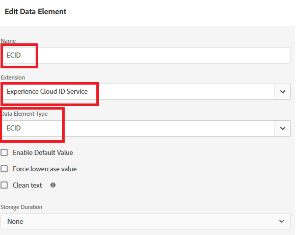

# Adobe Experience Platform タグの作成

Experience Platform タグは、web ページでAdobe Experience Platform Web SDKを読み込むように設定され、パーソナライズされたエクスペリエンスをトリガーするためのsendEvent API呼び出しを有効にします。 この設定により、必要なクライアントサイドライブラリが正しく初期化され、オファーの配信にAdobe Journey Optimizerを使用してリアルタイムのインタラクションが可能になります。

1. データ収集にログインします。
1. **[!UICONTROL タグ]**/**[!UICONTROL 新規プロパティ]**&#x200B;をクリックします。
1. ECID サービスという名前のAdobe Experience Platform タグを作成します。
1. タグに次の拡張機能を追加します。

   

1. 前のチュートリアルで作成した正しい環境とFinancial Advisors DataStreamを使用するようにAdobe Experience Platform Web SDKを設定します

   

Adobe Client Data Layerとコア拡張機能に追加の設定は必要ありません

## データ要素の作成

Experience Platform タグのECID データ要素は、デバッグとテストのみを目的として作成されます。 data elementを使用すると、開発者はユーザーのブラウザーセッションに割り当てられたExperience Cloud IDを表示できます。これにより、ID ステッチを検証し、`sendEvent`呼び出しが正しいプロファイルに関連付けられていることを確認できます。 この要素は、パーソナライゼーションが機能するために必要ではありませんが、実装時やQA時に役立ちます

## HTML ページにAEP タグを含める

Adobe Experience Platform タグを作成して公開します。

AEP Tags プロパティが公開されると、Adobeは、HTML `<head>`内または`<body>` タグの下部に配置する必要があるスクリプトタグを提供します。

1. タグ（ECID サービス）プロパティに移動します。

1. 「環境」をクリックし、目的の環境（開発、ステージング、実稼動など）のインストールアイコンをクリックします。

1. 埋め込まれたコードに注意してください。

   このコードは、HTML ページの終了`</body>` タグの直前に配置する必要があります。
