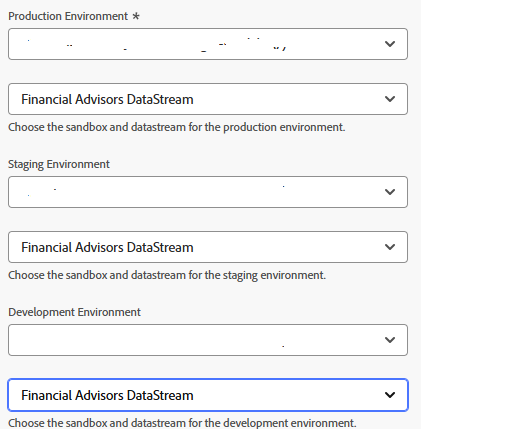

# Adobe Experience Platformを作成

Adobe Launch は、Adobe Experience Platform Web SDKを読み込むように Web ページに設定され、sendEvent API 呼び出しで、パーソナライズされたエクスペリエンスをトリガー化できます。 このセットアップにより、必要なクライアントサイドライブラリが正しく初期化され、オファー配信のためにAdobe Journey Optimizerとリアルタイムにやり取りできるようになります。

* データ収集へのログイン
* タグ/新しいプロパティをクリックします。
* ECID サービスというAdobe Experience Platform タグを作成します。

* タグに次の拡張機能を追加します
  

* 前のチュートリアルで作成した正しい環境とファイナンシャル・アドバイザのデータ・ストリームを使用するように、Adobe Experience Platformの WebSDKを必ず構成してください
  

* Adobe Client Data Layer および Core Extensions の設定は不要です

## データ要素の作成

Adobe Launch の ECID データ要素は、デバッグおよびテストのみを目的として作成されます。 これにより、開発者は、ユーザーのブラウザーセッションに割り当てられたExperience Cloud ID を表示できます。これにより、ID スティッチングを検証し、sendEvent 呼び出しが正しいプロファイルに関連付けられていることを確認できます。 この要素は、パーソナライゼーションが機能するために必要なものではありませんが、実装および QA 時に役立ちます


## HTML ページにAEP タグを含める

Adobe Experience Platform タグのビルドと公開

AEP タグプロパティが公開されると、Adobeによってスクリプトタグが提供されます。スクリプトタグは、HTML ``` <head>``` 内または ``` <body>``` タグの下部に配置する必要があります。

* タグ（ECID サービス）のプロパティに移動します。

* 「環境」をクリックし、目的とする環境のインストールアイコン（開発、ステージング、実稼動など）をクリックします。

* 埋め込みコードをメモします。 このコードは、HTMLページの終了 ```</body>``` タグの直前に配置する必要があります。
