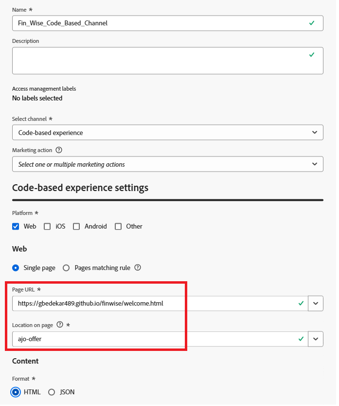

# コードベースのエクスペリエンスチャネルの構築

Adobe Journey Optimizer （AJO） [!UICONTROL Decisioning]でのコードベースのエクスペリエンスは、クライアントサイドのJavaScriptを使用して、パーソナライズされたオファーをweb ページに直接配信できるようにする設定です。 このアプローチでは、定義済みのテンプレートやビジュアルレイアウトツールに依存するのではなく、Adobe Web SDK （`Alloy.js`）を使用してオファーをレンダリングするタイミングと場所を開発者が完全に制御できます。

