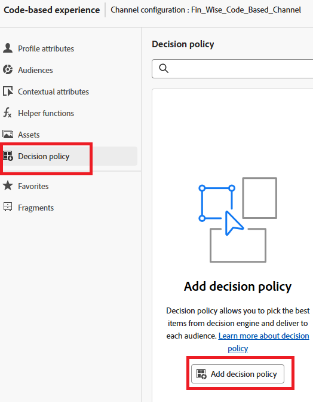
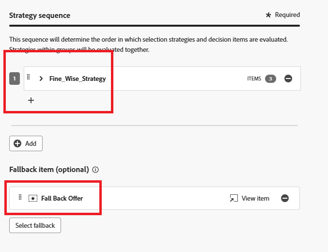
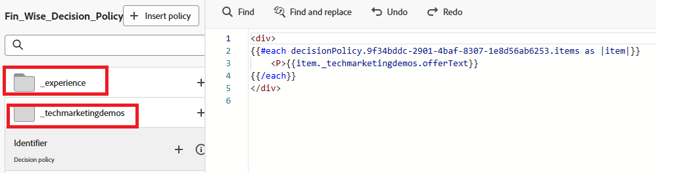

# 決定ポリシーの作成

決定ポリシーは、オーディエンスに応じて、配信する最適なコンテンツを選択するために[!UICONTROL Decisioning] エンジンを活用するオファーのコンテナです。

1. パーソナライゼーションエディターで、左側のナビゲーションで「**[!UICONTROL 決定ポリシー]**」項目をクリックし、「**[!UICONTROL 決定ポリシーを追加]**」をクリックします。

   

1. 「**[!UICONTROL 追加]**」をクリックして、選択戦略を選択します。

   

1. 「**[!UICONTROL フォールバックを選択]**」をクリックして、フォールバックオファーを選択します。
1. 決定ポリシーを確認するには、**[!UICONTROL 次へ]**&#x200B;をクリックします。
1. 決定ポリシーの作成プロセスを完了するには、**[!UICONTROL 作成]**&#x200B;をクリックします。

## コードエディターでの決定ポリシーの使用

1. パーソナライゼーションエディターで、**[!UICONTROL ポリシーの挿入]**&#x200B;をクリックします。

   決定ポリシーに対応するコードが追加されます。

   この段階で、必要な決定属性をコードに直接含めることができます。 これらの属性は、オファーカタログで使用されるスキーマで定義されます。 標準属性は`__experience`名前空間の下に整理され、組織に固有のカスタム属性は`_<imsOrg>`名前空間の下に保存されます。

   

   このコードは、ユーザーに対して選択されたパーソナライズされたオファーのリストを通過し、web ページ上に各オファーのテキストを表示します。 段落内の各オファーからのメッセージ（`offerText`と呼ばれる）が表示されるので、ユーザーはカスタマイズされたコンテンツを明確に確認できます。

   利用可能なパーソナライズされたオファーがない場合、フォールバックオファーが表示され、スペースを空白にしないようにします。

1. 「**[!UICONTROL 保存]**」をクリックし、キャンペーンをアクティブ化します。
