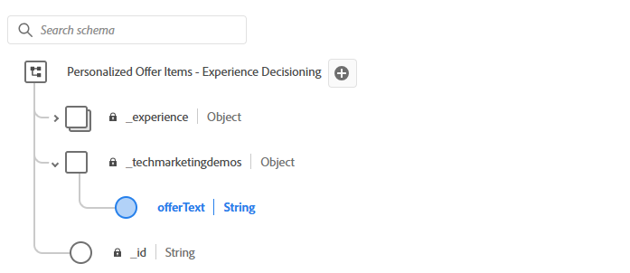

# オファーの作成

AJOのオファー項目には、パーソナライズされたコンテンツが含まれています。 コンテンツとは、意思決定ロジックにもとづいて、ユーザーに配信されるプロモーション、メッセージ、レコメンデーションなどです。

AJOでオファー項目を作成する場合は、[!UICONTROL Decisioning スキーマ &#x200B;]に基づく必要があります。 このスキーマは、タイトル、説明、imageURL、offerTextなど、オファーで使用できる構造とフィールドを定義します。

このスキーマ：

* コレクション内のすべてのオファーのコンテンツモデルを標準化します。

* オファー項目をまたいで一貫性のあるパーソナライゼーションフィールドを使用できます。

* 構造化コンテンツにルールを一致させる選択戦略を有効にします

## スキーマの変更

1. Journey Optimizerにログインします。
1. **[!UICONTROL Decisioning]** > **[!UICONTROL カタログ]** > **[!UICONTROL スキーマの編集]**&#x200B;をクリックします。
1. 次に示すように、`offerItem`という型`string`の要素を追加します

   

## オファーアイテムの作成

1. **[!UICONTROL 決定]** / **[!UICONTROL カタログ]** / **[!UICONTROL 項目を作成]**&#x200B;をクリックします。

1. 3つのオファー（`Love Stocks`、`Love Bonds`、`Love CD`）を作成します。

   各オファーについて、この記事の最後に提供されている対応するオファーテキストをコピーして、適切なオファー項目に貼り付けます。

1. 前の手順で作成したタグを使用して、オファーにタグ付けします。
1. 各オファーに適切なオーディエンスを追加。
   
1. オファーを承認します。

標準属性とカスタム属性が定義された完了オファー：


**愛するストック offerText**

```html
<div style="font-family: Arial, sans-serif; background-color: #f9f9f9; border: 1px solid #ddd; padding: 1.5rem; border-radius: 8px; max-width: 600px; margin: auto;">   <h3 style="color: #1a73e8; margin-top: 0;">📈 Open a Stock Trading Account & Get $100 in Bonus Stock</h3>   <p style="font-size: 1rem; color: #333;">     Ready to start building your portfolio? Open a new stock trading account with us and receive a      <strong>$100 bonus in stock</strong> — on us.   </p>   <ul style="padding-left: 1.25rem; color: #444;">     <li>🧾 No account minimums — start investing with as little as $1</li>     <li>📉 $0 commissions on online stock trades</li>     <li>📊 Access to powerful trading tools and real-time analytics</li>     <li>🎓 Free educational resources to help you invest confidently</li>   </ul>   <p style="color: #333;">     It's never been easier to start trading. Join thousands of investors who trust us to help them grow their wealth.   </p>   <a href="https://yourbrokerage.com/open-account"      style="display: inline-block; margin-top: 1rem; padding: 0.75rem 1.5rem; background-color: #1a73e8; color: white; text-decoration: none; border-radius: 5px; font-weight: bold;">      🚀 Open Your Account Today   </a> </div>
```

**Love Bonds offerText**

```html
<div style="font-family: Arial, sans-serif; background-color: #f9f9f9; border: 1px solid #ddd; padding: 1.5rem; border-radius: 8px; max-width: 600px; margin: auto;">   <h3 style="color: #6c757d; margin-top: 0;">🏦 Invest in Stability: Explore Our Premium Bond Options</h3>   <p style="font-size: 1rem; color: #333;">     Looking for consistent income with lower risk? Our carefully selected bonds offer predictable returns and help balance your investment portfolio.   </p>   <ul style="padding-left: 1.25rem; color: #444;">     <li>📉 Lower volatility than stocks — ideal for income-focused investors</li>     <li>💵 Earn interest payments monthly, quarterly, or annually</li>     <li>🔍 Choose from government, municipal, or corporate bonds</li>     <li>🎁 Open a bond investment account today and receive a <strong>$50 interest credit</strong></li>   </ul>   <p style="color: #333;">     Whether you're preparing for retirement or just want a reliable stream of income, bonds offer a solid foundation for your financial strategy.   </p>   <a href="https://yourfirm.com/open-bond-account"      style="display: inline-block; margin-top: 1rem; padding: 0.75rem 1.5rem; background-color: #6c757d; color: white; text-decoration: none; border-radius: 5px; font-weight: bold;">      🧾 Open a Bond Account   </a> </div>
```

**CD offerText**&#x200B;を気に入っています

```html
<div style="font-family: Arial, sans-serif; background-color: #f9f9f9; border: 1px solid #ddd; padding: 1.5rem; border-radius: 8px; max-width: 600px; margin: auto;">   <h3 style="color: #28a745; margin-top: 0;">💰 Lock in a 5.25% APY — Open Your CD Account Today</h3>   <p style="font-size: 1rem; color: #333;">     Secure your savings with a high-yield Certificate of Deposit. For a limited time, enjoy a      <strong>guaranteed 5.25% annual percentage yield (APY)</strong> on 12-month CDs.   </p>   <ul style="padding-left: 1.25rem; color: #444;">     <li>🔒 Guaranteed returns with FDIC insurance</li>     <li>📈 Lock in today's high rates before they change</li>     <li>💼 Flexible terms from 6 to 24 months</li>     <li>🎁 Open with just $500 and get a $50 bonus</li>   </ul>   <p style="color: #333;">     Whether you're saving for a short-term goal or building a conservative income strategy, our CDs offer peace of mind and predictable growth.   </p>   <a href="https://yourbank.com/open-cd"      style="display: inline-block; margin-top: 1rem; padding: 0.75rem 1.5rem; background-color: #28a745; color: white; text-decoration: none; border-radius: 5px; font-weight: bold;">      💼 Open a CD Account   </a> </div>
```
